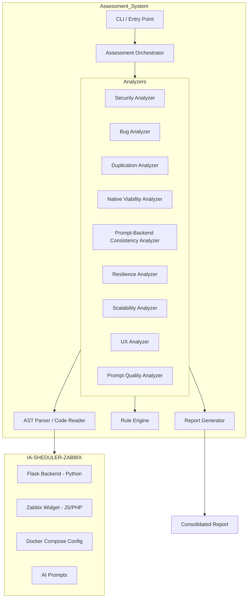
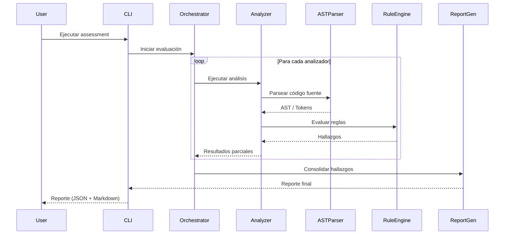

# Design Document — Maintenance Assistant Assessment

## Overview

El sistema de Assessment para el AI Maintenance Assistant (IA-SHEDULER-ZABBIX) es una herramienta de análisis estático y dinámico que evalúa el código del proyecto en múltiples dimensiones: seguridad, bugs, duplicación de código, viabilidad de ejecución nativa en widget, consistencia prompt-backend, resiliencia, escalabilidad, experiencia de usuario y calidad del prompt de IA.

El sistema produce un reporte consolidado con hallazgos clasificados por categoría y severidad, incluyendo recomendaciones priorizadas y una matriz de viabilidad nativa.

### Decisiones de Diseño Clave

1. **Arquitectura modular por analizador**: Cada dimensión de evaluación se implementa como un analizador independiente, permitiendo ejecución selectiva y extensibilidad.
2. **Motor de reglas configurable**: Las reglas de detección se definen de forma declarativa (YAML/JSON) para facilitar la actualización sin cambios de código.
3. **Análisis basado en AST**: Se utiliza análisis de árbol de sintaxis abstracta (AST) para Python y análisis de patrones para JavaScript/PHP, garantizando detección precisa de ubicaciones en código.
4. **Reporte estructurado con scoring**: El reporte final utiliza un sistema de scoring numérico (1-10) para riesgo general y métricas cuantificables por categoría.

## Architecture



### Flujo de Ejecución



## Components and Interfaces

### 1. Assessment Orchestrator

Coordina la ejecución de todos los analizadores y gestiona el ciclo de vida del assessment.

```python
class AssessmentOrchestrator:
    """Coordina la ejecución de analizadores y genera el reporte final."""
    
    def __init__(self, config: AssessmentConfig):
        self.config = config
        self.analyzers: list[BaseAnalyzer] = []
        self.findings: list[Finding] = []
    
    def register_analyzer(self, analyzer: BaseAnalyzer) -> None:
        """Registra un analizador para ejecución."""
        ...
    
    def run(self, project_path: str) -> AssessmentReport:
        """Ejecuta todos los analizadores registrados y genera el reporte."""
        ...
    
    def run_selective(self, project_path: str, categories: list[str]) -> AssessmentReport:
        """Ejecuta solo los analizadores de las categorías especificadas."""
        ...
```

### 2. Base Analyzer (Interfaz)

Interfaz base que todos los analizadores deben implementar.

```python
from abc import ABC, abstractmethod
from typing import List

class BaseAnalyzer(ABC):
    """Interfaz base para todos los analizadores del assessment."""
    
    @property
    @abstractmethod
    def category(self) -> str:
        """Categoría del analizador (seguridad, bug, duplicación, etc.)."""
        ...
    
    @abstractmethod
    def analyze(self, project_context: ProjectContext) -> List[Finding]:
        """Ejecuta el análisis y retorna hallazgos."""
        ...
    
    @abstractmethod
    def get_rules(self) -> List[Rule]:
        """Retorna las reglas que este analizador evalúa."""
        ...
```

### 3. Security Analyzer

```python
class SecurityAnalyzer(BaseAnalyzer):
    """Analiza riesgos de seguridad en el backend Flask."""
    
    category = "seguridad"
    
    def analyze(self, project_context: ProjectContext) -> List[Finding]:
        """
        Detecta:
        - Endpoints sin autenticación
        - CORS sin restricciones
        - Credenciales sin validación de presencia
        - Transmisión de tokens sin HTTPS
        - Ausencia de rate limiting
        """
        ...
    
    def check_cors_config(self, ast_tree: ast.Module) -> List[Finding]:
        """Detecta CORS(app) sin restricciones de origen."""
        ...
    
    def check_auth_endpoints(self, ast_tree: ast.Module) -> List[Finding]:
        """Identifica endpoints sin decoradores de autenticación."""
        ...
    
    def check_rate_limiting(self, ast_tree: ast.Module) -> List[Finding]:
        """Verifica presencia de rate limiting."""
        ...
```

### 4. Bug Analyzer

```python
class BugAnalyzer(BaseAnalyzer):
    """Detecta bugs y errores potenciales en el código."""
    
    category = "bug"
    
    def analyze(self, project_context: ProjectContext) -> List[Finding]:
        """
        Detecta:
        - Excepciones no capturadas
        - Valores de bitmask sin validación
        - Condiciones de carrera en widget
        - Respuestas de API sin validación de esquema
        - Timeouts sin reintentos
        """
        ...
    
    def check_unhandled_exceptions(self, ast_tree: ast.Module) -> List[Finding]:
        """Identifica rutas donde excepciones pueden causar HTTP 500."""
        ...
    
    def check_bitmask_validation(self, ast_tree: ast.Module) -> List[Finding]:
        """Verifica validación de bitmasks antes de envío a Zabbix API."""
        ...
```

### 5. Duplication Analyzer

```python
class DuplicationAnalyzer(BaseAnalyzer):
    """Detecta código duplicado usando análisis de similitud."""
    
    category = "duplicación"
    
    def analyze(self, project_context: ProjectContext) -> List[Finding]:
        """
        Detecta:
        - Bloques con similitud > 70%
        - Lógica de parsing duplicada
        - Formateo de mensajes duplicado entre backend y widget
        - Patrones repetitivos en manejo de recurrencia
        """
        ...
    
    def compute_similarity(self, block_a: CodeBlock, block_b: CodeBlock) -> float:
        """Calcula similitud entre dos bloques de código (0.0 - 1.0)."""
        ...
    
    def find_duplicates(self, threshold: float = 0.70) -> List[DuplicationPair]:
        """Encuentra pares de bloques con similitud sobre el umbral."""
        ...
```

### 6. Native Viability Analyzer

```python
class NativeViabilityAnalyzer(BaseAnalyzer):
    """Evalúa qué funcionalidades pueden ejecutarse nativamente en el widget."""
    
    category = "viabilidad_nativa"
    
    def analyze(self, project_context: ProjectContext) -> List[Finding]:
        """
        Evalúa:
        - Cálculo de bitmasks → nativa viable
        - Validación de tickets → nativa viable
        - Parsing de fechas → nativa parcial
        - Búsqueda de hosts/grupos → requiere backend
        """
        ...
    
    def generate_viability_matrix(self) -> ViabilityMatrix:
        """Genera la matriz de clasificación de funcionalidades."""
        ...
```

### 7. Consistency Analyzer

```python
class ConsistencyAnalyzer(BaseAnalyzer):
    """Verifica consistencia entre prompt de IA y lógica de backend."""
    
    category = "consistencia"
    
    def analyze(self, project_context: ProjectContext) -> List[Finding]:
        """
        Verifica:
        - Valores de bitmask prompt vs Zabbix API
        - Formatos de fecha prompt vs backend
        - Tipos de respuesta prompt vs widget
        - Campos opcionales vs obligatorios
        """
        ...
    
    def extract_prompt_schema(self, prompt_text: str) -> PromptSchema:
        """Extrae el esquema esperado del prompt de IA."""
        ...
    
    def extract_backend_schema(self, ast_tree: ast.Module) -> BackendSchema:
        """Extrae el esquema procesado por el backend."""
        ...
    
    def compare_schemas(self, prompt: PromptSchema, backend: BackendSchema) -> List[Finding]:
        """Compara esquemas y reporta discrepancias."""
        ...
```

### 8. Report Generator

```python
class ReportGenerator:
    """Genera el reporte consolidado del assessment."""
    
    def generate(self, findings: List[Finding]) -> AssessmentReport:
        """Genera el reporte completo con todas las secciones."""
        ...
    
    def classify_findings(self, findings: List[Finding]) -> Dict[str, List[Finding]]:
        """Clasifica hallazgos por categoría y severidad."""
        ...
    
    def compute_risk_score(self, findings: List[Finding]) -> int:
        """Calcula el score de riesgo general (1-10)."""
        ...
    
    def identify_quick_wins(self, findings: List[Finding]) -> List[Finding]:
        """Identifica correcciones de bajo esfuerzo y alto impacto (<2h)."""
        ...
    
    def generate_executive_summary(self, report: AssessmentReport) -> ExecutiveSummary:
        """Genera resumen ejecutivo con métricas consolidadas."""
        ...
    
    def export_markdown(self, report: AssessmentReport) -> str:
        """Exporta el reporte en formato Markdown."""
        ...
    
    def export_json(self, report: AssessmentReport) -> str:
        """Exporta el reporte en formato JSON estructurado."""
        ...
```

## Data Models

```python
from dataclasses import dataclass, field
from enum import Enum
from typing import Optional, List, Dict
from datetime import datetime


class Severity(Enum):
    CRITICAL = "crítico"
    HIGH = "alto"
    MEDIUM = "medio"
    LOW = "bajo"


class Category(Enum):
    SECURITY = "seguridad"
    BUG = "bug"
    DUPLICATION = "duplicación"
    PERFORMANCE = "rendimiento"
    USABILITY = "usabilidad"
    CONSISTENCY = "consistencia"
    RESILIENCE = "resiliencia"
    SCALABILITY = "escalabilidad"
    NATIVE_VIABILITY = "viabilidad_nativa"
    PROMPT_QUALITY = "calidad_prompt"


class NativeViability(Enum):
    NATIVE_VIABLE = "nativa viable"
    NATIVE_PARTIAL = "nativa parcial (requiere fallback al backend)"
    REQUIRES_BACKEND = "requiere backend obligatoriamente"


@dataclass
class CodeLocation:
    """Ubicación exacta en el código fuente."""
    file_path: str
    line_start: int
    line_end: int
    column_start: Optional[int] = None
    column_end: Optional[int] = None
    snippet: Optional[str] = None


@dataclass
class Finding:
    """Un hallazgo individual del assessment."""
    id: str
    title: str
    description: str
    category: Category
    severity: Severity
    location: CodeLocation
    impact: str
    recommendation: str
    effort_hours: Optional[float] = None  # Estimación de esfuerzo para corregir
    is_quick_win: bool = False


@dataclass
class DuplicationPair:
    """Par de bloques de código duplicados."""
    block_a: CodeLocation
    block_b: CodeLocation
    similarity: float  # 0.0 - 1.0
    suggested_abstraction: Optional[str] = None


@dataclass
class ViabilityEntry:
    """Entrada en la matriz de viabilidad nativa."""
    functionality: str
    current_location: str  # "backend", "widget", "both"
    viability: NativeViability
    rationale: str
    migration_effort: Optional[str] = None  # "bajo", "medio", "alto"
    dependencies: List[str] = field(default_factory=list)


@dataclass
class ViabilityMatrix:
    """Matriz completa de viabilidad nativa."""
    entries: List[ViabilityEntry]
    summary: str
    
    @property
    def native_viable_count(self) -> int:
        return sum(1 for e in self.entries if e.viability == NativeViability.NATIVE_VIABLE)
    
    @property
    def requires_backend_count(self) -> int:
        return sum(1 for e in self.entries if e.viability == NativeViability.REQUIRES_BACKEND)


@dataclass
class ExecutiveSummary:
    """Resumen ejecutivo del assessment."""
    total_findings: int
    findings_by_category: Dict[Category, int]
    findings_by_severity: Dict[Severity, int]
    risk_score: int  # 1-10
    technical_debt_hours: float
    quick_wins_count: int
    critical_issues_count: int


@dataclass
class AssessmentReport:
    """Reporte consolidado del assessment."""
    project_name: str
    assessment_date: datetime
    executive_summary: ExecutiveSummary
    findings: List[Finding]
    viability_matrix: ViabilityMatrix
    quick_wins: List[Finding]
    recommendations_by_priority: List[Finding]


@dataclass
class Rule:
    """Regla de detección configurable."""
    id: str
    name: str
    description: str
    category: Category
    severity: Severity
    pattern: str  # Regex o AST pattern
    enabled: bool = True


@dataclass
class AssessmentConfig:
    """Configuración del assessment."""
    project_path: str
    output_format: str = "markdown"  # "markdown" | "json" | "both"
    categories: List[str] = field(default_factory=lambda: ["all"])
    similarity_threshold: float = 0.70
    include_quick_wins: bool = True
    max_findings_per_category: Optional[int] = None


@dataclass
class ProjectContext:
    """Contexto del proyecto bajo análisis."""
    project_path: str
    backend_files: List[str]
    widget_files: List[str]
    docker_files: List[str]
    prompt_files: List[str]
    config: AssessmentConfig
```

## Correctness Properties

*A property is a characteristic or behavior that should hold true across all valid executions of a system—essentially, a formal statement about what the system should do. Properties serve as the bridge between human-readable specifications and machine-verifiable correctness guarantees.*

### Property 1: Code Similarity Metric Invariants

*For any* two code blocks A and B, the similarity function SHALL satisfy: (a) symmetry: similarity(A, B) == similarity(B, A), (b) bounds: 0.0 <= similarity(A, B) <= 1.0, (c) identity: similarity(A, A) == 1.0, and (d) threshold filtering: if similarity(A, B) > threshold, the pair appears in duplicates; if similarity(A, B) <= threshold, it does not.

**Validates: Requirements 3.1**

### Property 2: Schema Comparison Detects All Value and Format Discrepancies

*For any* prompt schema and backend schema containing bitmask values and date formats, the consistency analyzer SHALL report every value that exists in one schema but not the other (no false negatives), and SHALL NOT report values that are consistent between both schemas (no false positives).

**Validates: Requirements 5.1, 5.2**

### Property 3: Schema Comparison Detects All Type and Optionality Mismatches

*For any* set of response types defined in a prompt and a set of types handled in a widget, the consistency analyzer SHALL correctly identify the symmetric difference (unhandled types and unexpected types). Additionally, *for any* field defined as optional in the prompt but required in the backend (or vice versa), the analyzer SHALL report the mismatch.

**Validates: Requirements 5.3, 5.4**

### Property 4: Viability Matrix Categorization Consistency

*For any* list of ViabilityEntry objects, the viability matrix SHALL correctly partition entries into exactly three categories ("nativa viable", "nativa parcial", "requiere backend obligatoriamente"), and the sum of entries across all categories SHALL equal the total number of input entries (no entries lost or duplicated).

**Validates: Requirements 4.5**

### Property 5: Report Preserves All Findings with Correct Classification

*For any* list of findings with assigned categories and severities, the generated report SHALL contain every input finding exactly once, grouped under its correct category and severity level. Additionally, every finding in the report SHALL include non-empty description, location, impact, and recommendation fields.

**Validates: Requirements 10.1, 10.2**

### Property 6: Quick Wins Filtering Correctness

*For any* list of findings with varying effort_hours and severity values, the quick wins section SHALL contain exactly those findings where effort_hours < 2.0 AND severity is CRITICAL or HIGH, and SHALL NOT contain findings that don't meet both criteria.

**Validates: Requirements 10.3**

### Property 7: Executive Summary Metrics Consistency

*For any* set of findings, the executive summary SHALL satisfy: (a) total_findings equals the count of all findings, (b) the sum of findings_by_category values equals total_findings, (c) the sum of findings_by_severity values equals total_findings, (d) risk_score is in the range [1, 10], and (e) technical_debt_hours equals the sum of all findings' effort_hours.

**Validates: Requirements 10.5**

### Property 8: Security Endpoint Classification Completeness

*For any* Flask application AST containing route definitions with and without authentication decorators, the security analyzer SHALL identify all unauthenticated endpoints and classify each into exactly one severity level (alto, medio, bajo). The set of identified endpoints SHALL be a subset of all defined endpoints, and no authenticated endpoint SHALL appear in the results.

**Validates: Requirements 1.1**

### Property 9: Docker Port Conflict Detection

*For any* Docker Compose configuration with multiple service definitions, the scalability analyzer SHALL detect all port mapping conflicts (same host port assigned to different services) and network conflicts (overlapping subnets), producing no false positives for non-conflicting configurations.

**Validates: Requirements 7.1**

## Error Handling

### Estrategia General de Manejo de Errores

| Escenario | Comportamiento | Resultado |
|-----------|---------------|-----------|
| Archivo fuente no encontrado | Log warning, continuar con siguientes archivos | Finding parcial con nota de archivo faltante |
| Error de parsing AST (sintaxis inválida) | Capturar SyntaxError, reportar como finding informativo | Análisis continúa con archivos restantes |
| Regla con patrón regex inválido | Log error, deshabilitar regla, continuar | Regla omitida del análisis |
| Timeout en análisis de similitud | Limitar comparaciones por batch, reportar análisis parcial | Reporte indica cobertura parcial |
| Proyecto sin archivos del tipo esperado | Retornar lista vacía de findings para esa categoría | Reporte indica categoría sin hallazgos |
| Configuración inválida | Validar al inicio, fallar rápido con mensaje claro | Error descriptivo antes de iniciar análisis |

### Errores por Componente

**AST Parser:**
- `SyntaxError` en archivos Python: Registrar ubicación, continuar con siguiente archivo
- Archivos JavaScript/PHP con sintaxis no soportada: Fallback a análisis basado en regex
- Archivos binarios o no-texto: Ignorar silenciosamente

**Rule Engine:**
- Regla con patrón inválido: Deshabilitar regla, log warning
- Regla que produce demasiados matches (>1000): Truncar resultados, reportar overflow

**Report Generator:**
- Findings sin campos requeridos: Validar antes de incluir, log warning para findings incompletos
- Error en cálculo de métricas: Usar valores por defecto seguros (risk_score=0, debt=0)

**Orchestrator:**
- Analizador que lanza excepción no capturada: Capturar, log error, continuar con siguiente analizador
- Todos los analizadores fallan: Generar reporte vacío con sección de errores

### Códigos de Salida

```python
class ExitCode(Enum):
    SUCCESS = 0                    # Assessment completado exitosamente
    PARTIAL_SUCCESS = 1            # Assessment completado con warnings
    CONFIGURATION_ERROR = 2        # Error en configuración
    PROJECT_NOT_FOUND = 3          # Proyecto no encontrado
    CRITICAL_ANALYZER_FAILURE = 4  # Analizador crítico falló
```

## Testing Strategy

### Enfoque Dual de Testing

El proyecto utiliza un enfoque dual complementario:

1. **Tests unitarios (example-based)**: Para casos específicos, edge cases, detección de patrones conocidos y validación de integraciones.
2. **Tests de propiedades (property-based)**: Para verificar invariantes universales del sistema de análisis y generación de reportes.

### Property-Based Testing

**Librería**: [Hypothesis](https://hypothesis.readthedocs.io/) (Python)

**Configuración**:
- Mínimo 100 iteraciones por test de propiedad
- Cada test referencia su propiedad del documento de diseño
- Formato de tag: `Feature: maintenance-assistant-assessment, Property {number}: {property_text}`

**Properties a implementar**:

| Property | Descripción | Generadores |
|----------|-------------|-------------|
| 1 | Similarity metric invariants | Pares de strings/code blocks aleatorios |
| 2 | Schema comparison (values/formats) | Diccionarios con keys/values aleatorios |
| 3 | Schema comparison (types/optionality) | Sets de strings + flags booleanos |
| 4 | Viability matrix categorization | Listas de ViabilityEntry con clasificaciones aleatorias |
| 5 | Report preserves findings | Listas de Finding con campos aleatorios válidos |
| 6 | Quick wins filtering | Listas de Finding con effort_hours y severity aleatorios |
| 7 | Executive summary consistency | Listas de Finding con categorías y severidades aleatorias |
| 8 | Endpoint classification | ASTs de Flask con rutas con/sin auth aleatorias |
| 9 | Docker port conflict detection | Configs Docker Compose con puertos aleatorios |

### Unit Tests (Example-Based)

**Casos específicos a cubrir**:

- Detección de `CORS(app)` sin restricciones (Req 1.2)
- Detección de credenciales sin validación (Req 1.3)
- Detección de token sin HTTPS (Req 1.4)
- Detección de ausencia de rate limiting (Req 1.5)
- Condiciones de carrera en widget (Req 2.3)
- Método `_make_request` sin validación de esquema (Req 2.4)
- Timeout sin reintentos (Req 2.5)
- Duplicación de parsing de tickets (Req 3.2)
- Duplicación cross-language backend/widget (Req 3.3)
- Patrones repetitivos de recurrencia (Req 3.4)
- Clasificación de bitmask engine como nativa viable (Req 4.1)
- Clasificación de validación de tickets como nativa viable (Req 4.2)
- Clasificación de búsqueda de hosts como requiere backend (Req 4.4)
- Degradación graceful ante fallo de Zabbix API (Req 6.1)
- Fallback ante fallo de AI Provider (Req 6.2)
- Evaluación de retry/timeout del widget (Req 6.3)
- Manejo de pérdida de conexión en confirmación (Req 6.4)
- Conflictos de estado compartido (Req 7.2)
- Capacidad de subnet (Req 7.3)
- Estimación de recursos (Req 7.4)
- Verificación de onboarding (Req 8.1)
- Mensajes de error en español (Req 8.2)
- Flujo de confirmación claro (Req 8.3)
- Feedback visual en operaciones largas (Req 8.4)
- Ambigüedades en prompt (Req 9.1)
- Cobertura de ejemplos en prompt (Req 9.2)
- Edge cases no cubiertos en prompt (Req 9.3)
- Eficiencia de tokens del prompt (Req 9.4)
- Manejo de solicitudes ambiguas (Req 9.5)
- Inclusión de viability matrix en reporte (Req 10.4)

### Estructura de Tests

```
tests/
├── unit/
│   ├── test_security_analyzer.py
│   ├── test_bug_analyzer.py
│   ├── test_duplication_analyzer.py
│   ├── test_native_viability_analyzer.py
│   ├── test_consistency_analyzer.py
│   ├── test_resilience_analyzer.py
│   ├── test_scalability_analyzer.py
│   ├── test_ux_analyzer.py
│   ├── test_prompt_quality_analyzer.py
│   └── test_report_generator.py
├── property/
│   ├── test_similarity_properties.py
│   ├── test_schema_comparison_properties.py
│   ├── test_viability_matrix_properties.py
│   ├── test_report_properties.py
│   ├── test_quick_wins_properties.py
│   ├── test_executive_summary_properties.py
│   ├── test_endpoint_classification_properties.py
│   └── test_docker_conflict_properties.py
└── fixtures/
    ├── sample_flask_app.py
    ├── sample_widget.js
    ├── sample_docker_compose.yml
    └── sample_prompt.txt
```

### Herramientas

- **Framework de tests**: pytest
- **Property-based testing**: Hypothesis
- **Cobertura**: pytest-cov (objetivo: >80% en módulos core)
- **Linting**: ruff
- **Type checking**: mypy

