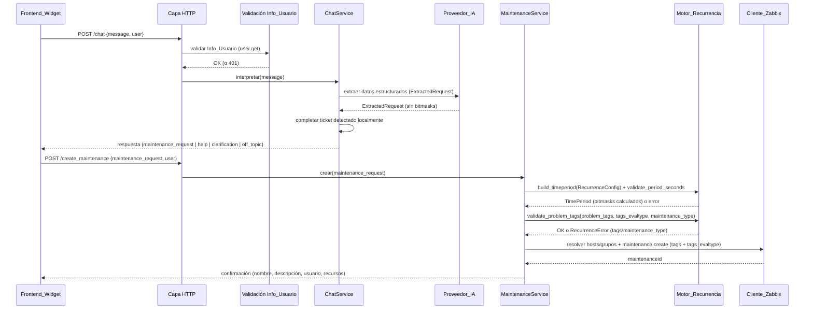

# Design Document

## Overview

Este documento describe el diseño técnico de **zabbix-ai-maintenance-v2**, la migración del "AI Maintenance Assistant for Zabbix 7.2" desde un backend monolítico (un único `main.py` de más de 1600 líneas) hacia una arquitectura limpia, modular y probada, sin regresiones funcionales.

El diseño persigue los cuatro objetivos definidos en los requisitos:

1. **Arquitectura limpia** (Req 1, 17): descomponer el monolito en módulos con responsabilidad única — configuración, cliente Zabbix, abstracción de proveedores de IA, motor de recurrencia determinista, utilidades de dominio y capa HTTP — donde el punto de entrada no contiene lógica de negocio.
2. **Optimización de tokens de IA** (Req 3): mover **toda** la aritmética de bitmasks fuera del `Prompt_IA` hacia el `Motor_Recurrencia`. El LLM solo extrae datos estructurados (conjuntos de días/meses/ocurrencias, horas, duración, hosts, grupos, tickets, tipo de recurrencia); el backend calcula los bitmasks de forma determinista. Se externaliza el prompt, se limita a un máximo de 5 ejemplos y se reduce el conteo de tokens en ≥30%.
3. **Correctitud y paridad garantizadas** (Req 2, 4–9, 20): el `Motor_Recurrencia` se implementa como funciones puras verificadas con pruebas basadas en propiedades y pruebas exhaustivas (127 casos de `Bitmask_Dias`, 4095 casos de `Bitmask_Meses`, 5 casos de `Ocurrencia_Semana`), garantizando igualdad campo por campo con la versión monolítica.
4. **Separación backend/frontend y despliegue** (Req 15–19): carpetas de nivel superior separadas (`backend/` y `widget/`), preservando el `Contrato_API`, la compatibilidad del widget de Zabbix 7.2+, el flujo Docker y la publicación al mismo repositorio de GitHub y registro de contenedores.

Además, la v2 incorpora un conjunto de **mejoras de calidad, robustez y experiencia de usuario** (Req 21–30) que se apoyan en la misma arquitectura limpia sin alterar el núcleo de paridad ni el `Contrato_API`:

5. **Internacionalización y experiencia** (Req 21–25): resolución de idioma como función pura y catálogos de mensajes por locale en el backend; modularización de la lógica JavaScript del widget (renderizado / cliente HTTP / formateo), accesibilidad WCAG 2.1 AA, mejoras de UX del chat (indicador de procesamiento, historial de sesión, reintento manual, vista previa legible del mantenimiento) y soporte de tema claro/oscuro.
6. **Robustez y operación** (Req 26–30): failover entre proveedores de IA con degradación explícita, caché de validación de usuario con TTL, limitación de tasa por cliente, validación de la respuesta de IA contra un `Esquema_JSON` con reintentos acotados, y observabilidad (endpoint `/metrics` compatible con Prometheus más `Log_Seguro` con enmascaramiento de secretos).

Todas estas mejoras aíslan su lógica de decisión en **funciones puras** nuevas (`resolve_locale`, `is_cache_entry_valid`, decisión de rate-limit, `validate_against_schema`, `mask_sensitive`, `select_provider`), verificables con property-based testing, mientras que la orquestación con efectos (middleware, red, logging, métricas) se prueba con ejemplos e integración.

Este diseño también aborda los hallazgos documentados en el spec hermano `maintenance-assistant-assessment` allí donde intersecan con los objetivos de v2: monólito (→ modularización, Req 1 y widget Req 22), prompt de 300+ líneas (→ optimización de tokens, Req 3), CORS sin restricciones (→ CORS con orígenes permitidos configurables, Req 15.5), ausencia de tests (→ estrategia dual PBT + unitarios, Req 20), sin failover de IA (→ interfaz común de proveedor con degradación explícita y orquestación de failover, Req 12.5, 26), llamadas de red secuenciales (→ resolución de hosts/grupos encapsulada y deduplicada, Req 14) y validación de usuario en cada petición (→ caché con TTL, Req 27).

### Principios de Diseño

- **Núcleo puro, bordes con efectos**: el `Motor_Recurrencia` y las utilidades de dominio son funciones puras, deterministas y sin E/S. El `Cliente_Zabbix` y el `Proveedor_IA` concentran los efectos de red. La capa HTTP orquesta.
- **La IA extrae, el backend calcula**: el LLM nunca realiza aritmética de bitmasks ni conversiones de tiempo. Produce un contrato de datos estructurado (`ExtractedRequest`) que el backend valida y transforma.
- **Contrato observable inmutable**: rutas, campos de petición/respuesta y tipos de dato del `Contrato_API` se preservan exactamente para no romper el `Frontend_Widget`.
- **Configuración por entorno**: toda la configuración sensible se carga desde variables de entorno mediante un único módulo; ningún secreto vive en el código ni en la imagen.
- **Decisiones puras, efectos en los bordes (extensión Req 21–30)**: cada mejora transversal separa su regla de decisión (una función pura y determinista) de su ejecución con efectos. `resolve_locale`, `is_cache_entry_valid`, la decisión de rate-limit, `validate_against_schema`, `mask_sensitive` y `select_provider` son puras; el middleware de rate-limit, la caché, el `FailoverAIProvider`, el logger seguro y el endpoint de métricas son los bordes que las aplican.
- **Localización sin ramificar el núcleo**: el idioma afecta únicamente a la capa de mensajes (`i18n`); el `Motor_Recurrencia` y el `Contrato_API` permanecen invariantes respecto del `Locale`.
- **Seguridad por defecto en la observabilidad**: ningún registro se emite sin pasar por `mask_sensitive`; el endpoint `/metrics` no expone valores de configuración sensibles.

### Decisión de arquitectura: MCP (evaluado, diferido)

Se evaluó migrar la solución a un servidor **MCP (Model Context Protocol)**, en particular el proyecto `zabbix-mcp-server` de initMAX, que expone toda la API de Zabbix como *tools* consumibles por clientes de IA (Claude, ChatGPT, Copilot), con ~223 tools y licencia AGPL-3.0. Tras el análisis, la decisión es **no** reemplazar el widget + backend por MCP en la v2, por los siguientes motivos:

- **Canales de uso distintos, no equivalentes**: el widget atiende a operadores *dentro* del dashboard de Zabbix, mientras que un servidor MCP atiende a usuarios de clientes de IA externos. No son sustitutos entre sí.
- **Reintroduce el riesgo de correctitud que la v2 elimina**: en el enfoque MCP, el cálculo de los bitmasks de `timeperiods` recaería en el LLM del cliente; esto revive exactamente el riesgo que la v2 suprime al trasladar el cálculo al `Motor_Recurrencia` determinista (Req 2, 3, 20).
- **Puerta abierta sin costo actual**: dado que el `Motor_Recurrencia` y las utilidades de dominio son núcleo puro sin dependencias de Flask, en el futuro se podría exponer el mismo backend como una capa MCP adicional (reutilizando el núcleo determinista) sin rehacer la lógica. Queda documentado como posible fase futura, fuera del alcance de la v2.

## Architecture

La arquitectura separa el sistema en dos artefactos desplegables de forma independiente (`backend/` y `widget/`). Dentro del backend, las dependencias fluyen en una sola dirección: desde la capa HTTP hacia el núcleo puro, nunca a la inversa.

```mermaid
graph TB
    subgraph Frontend_Widget["Frontend_Widget (widget/ - PHP/JS)"]
        WUI["ui/renderer (renderizado + a11y + tema)"]
        WHTTP["http/client (cliente HTTP)"]
        WFMT["format/messages (formateo + preview)"]
        WPHP["Widget/WidgetView/WidgetForm + manifest.json 2.0 + views (i18n nativo Zabbix)"]
    end

    subgraph Backend["Backend (backend/ - Python/Flask)"]
        direction TB
        Entry["app.py (app factory / entry point)"]

        subgraph HTTP["Capa HTTP (api/)"]
            Routes["Blueprints: chat, maintenance, search, health, metrics"]
            CORS["CORS (orígenes permitidos)"]
            RateMW["Rate-limit middleware (429)"]
            AuthMW["Validación Info_Usuario + caché TTL"]
            Metrics["/metrics (Prometheus)"]
        end

        subgraph Services["Servicios / Orquestación (services/)"]
            ChatSvc["ChatService"]
            MaintSvc["MaintenanceService"]
        end

        subgraph Providers["Proveedor_IA (ai/)"]
            Failover["FailoverAIProvider (orquestación)"]
            AIFace["AIProvider (interfaz común)"]
            Gemini["GeminiProvider"]
            OpenAI["OpenAIProvider"]
            PromptMod["prompt (recurso externalizado, <=5 ejemplos)"]
            SchemaVal["validate_against_schema (Esquema_JSON)"]
        end

        subgraph I18n["Localización (i18n/)"]
            LocRes["resolve_locale (pura)"]
            Catalog["catálogos de mensajes por locale"]
        end

        subgraph Obs["Observabilidad (observability/)"]
            SecLog["Log_Seguro (mask_sensitive)"]
            MetReg["registro de métricas"]
        end

        subgraph Cache["Caché (cache/)"]
            UserCache["caché de Info_Usuario (is_cache_entry_valid)"]
        end

        subgraph Core["Núcleo puro (core/)"]
            Recur["Motor_Recurrencia (funciones puras)"]
            DomainUtil["Utilidades de dominio (tickets, nombres, decode)"]
        end

        ZbxClient["Cliente_Zabbix (zabbix/ - JSON-RPC 7.2)"]
        Config["config (único módulo, env vars)"]
    end

    subgraph External["Externos"]
        ZabbixAPI["Zabbix API 7.2 (JSON-RPC)"]
        LLM_P["LLM primario (Gemini / OpenAI)"]
        LLM_S["LLM secundario (failover)"]
        Prom["Prometheus / scraper"]
    end

    WUI --> WHTTP
    WUI --> WFMT
    WHTTP -->|"HTTP /chat /parse /create_maintenance (+ locale) ..."| Routes
    Routes --> CORS
    Routes --> RateMW
    RateMW --> AuthMW
    Routes --> ChatSvc
    Routes --> MaintSvc
    Routes --> Metrics
    Metrics --> MetReg
    Prom -->|"scrape"| Metrics
    ChatSvc --> Failover
    ChatSvc --> DomainUtil
    ChatSvc --> LocRes
    ChatSvc --> Catalog
    MaintSvc --> Recur
    MaintSvc --> DomainUtil
    MaintSvc --> ZbxClient
    MaintSvc --> Catalog
    Failover --> AIFace
    Failover --> SchemaVal
    Failover --> SecLog
    AIFace --> Gemini
    AIFace --> OpenAI
    AIFace --> PromptMod
    Gemini --> LLM_P
    OpenAI --> LLM_P
    Failover -.->|"fallo/timeout"| LLM_S
    AuthMW --> UserCache
    UserCache --> ZbxClient
    ZbxClient --> ZabbixAPI
    Entry --> HTTP
    Entry --> Config
    Entry --> Obs
    SecLog -.-> Services
    SecLog -.-> Providers
    Config -.-> Providers
    Config -.-> ZbxClient
    Config -.-> I18n
    Config -.-> Cache
    Config -.-> RateMW
```



### Flujo de creación de un mantenimiento



### Dependencias entre capas

- La **capa HTTP** depende de **servicios**; los servicios dependen del **núcleo puro**, del **Proveedor_IA** y del **Cliente_Zabbix**.
- El **núcleo puro** (`Motor_Recurrencia`, utilidades de dominio) no depende de Flask, ni del proveedor de IA, ni del cliente de Zabbix (Req 1.4). Es invocable de forma aislada y es la unidad principal bajo prueba.
- El **módulo de configuración** es la única fuente de variables de entorno (Req 1.3) y lo consumen el `Proveedor_IA`, el `Cliente_Zabbix`, la localización (`i18n`), la caché, el middleware de rate-limit y la observabilidad en su construcción.
- Las **decisiones transversales** (locale, TTL de caché, rate-limit, validación de esquema, enmascaramiento, selección de proveedor) residen en funciones puras sin dependencias de Flask; sus bordes (middleware de rate-limit, caché, `FailoverAIProvider`, `Log_Seguro`, endpoint `/metrics`) dependen de ellas, nunca a la inversa (Req 21.7, 27.4, 28.4, 29.4, 30.4, 26).
- El **middleware de rate-limit** se aplica antes de la validación de usuario y de la orquestación de servicios (Req 28.1). La **caché de `Info_Usuario`** se interpone entre la validación de usuario y el `Cliente_Zabbix` (Req 27.2).
- El **`FailoverAIProvider`** envuelve a uno o dos `AIProvider` concretos y aplica `select_provider` y `validate_against_schema` antes de entregar el `ExtractedRequest` al `ChatService` (Req 26, 29).

## Components and Interfaces

### Estructura de carpetas propuesta (Req 17)

```
zabbix-ai-maintenance-v2/            # (raíz publicada al repo GitHub existente)
├── backend/                         # Artefacto desplegable 1 (Req 17.1, 17.2)
│   ├── app.py                       # App factory / entry point (sin lógica de negocio, Req 1.2)
│   ├── config.py                    # Único módulo de configuración (Req 1.3)
│   ├── api/                         # Capa HTTP (blueprints)
│   │   ├── __init__.py
│   │   ├── chat.py                  # POST /chat, POST /parse (alias)
│   │   ├── maintenance.py           # POST /create_maintenance, /maintenance/list, /maintenance/templates, /test/routine
│   │   ├── search.py                # POST /search_hosts, POST /search_groups
│   │   ├── health.py                # GET /health
│   │   ├── metrics.py               # GET /metrics (Prometheus) (Req 30.1)
│   │   ├── rate_limit.py            # Middleware de rate-limit por cliente (Req 28.1-28.3)
│   │   └── auth.py                  # Validación de Info_Usuario + caché TTL (Req 11, 27)
│   ├── services/
│   │   ├── chat_service.py          # Orquesta IA + detección de tickets + locale
│   │   └── maintenance_service.py   # Orquesta recurrencia + resolución + creación
│   ├── ai/
│   │   ├── provider.py              # Interfaz común AIProvider (Req 12.4)
│   │   ├── gemini_provider.py
│   │   ├── openai_provider.py
│   │   ├── failover.py              # FailoverAIProvider + select_provider (Req 26)
│   │   ├── schema.py                # Esquema_JSON de ExtractedRequest + validate_against_schema (Req 29)
│   │   ├── factory.py               # Construye primario + secundario opcional (Req 12.1, 26)
│   │   └── prompt.py                # Prompt externalizado (<=5 ejemplos, Req 3.3, 3.5)
│   ├── i18n/                        # Localización (Req 21)
│   │   ├── __init__.py
│   │   ├── locale.py                # resolve_locale (función pura, Req 21.7)
│   │   ├── messages.py              # API de lookup de mensajes por locale (Req 21.4)
│   │   └── catalogs/
│   │       ├── es.py                # catálogo por defecto (Req 21.5, 21.6)
│   │       └── en.py                # catálogo alterno
│   ├── cache/                       # Caché de validación de usuario (Req 27)
│   │   └── user_cache.py            # is_cache_entry_valid (pura) + abstracción de caché
│   ├── observability/               # Observabilidad y registro seguro (Req 30)
│   │   ├── logger.py                # Log_Seguro estructurado + mask_sensitive (pura) (Req 30.2-30.4)
│   │   └── metrics.py               # registro/colección de métricas Prometheus (Req 30.1)
│   ├── core/
│   │   ├── recurrence.py            # Motor_Recurrencia (funciones puras, Req 2, 4-9)
│   │   └── domain.py                # tickets, nombres, descripciones, decode bitmasks, preview (Req 10, 20.6, 24.5)
│   ├── zabbix/
│   │   └── client.py                # Cliente_Zabbix JSON-RPC 7.2 (Req 14)
│   ├── tests/
│   │   ├── unit/
│   │   ├── property/
│   │   └── integration/
│   ├── requirements.txt             # Dependencias con versiones fijadas (Req 1.6)
│   ├── Dockerfile                   # (Req 18.1)
│   ├── docker-compose.yml           # instancias aima1-5, puertos 5005-5009 (Req 18.2)
│   ├── .env.example                 # (Req 18.3)
│   └── README.md                    # Despliegue del backend (Req 17.4)
├── widget/                          # Artefacto desplegable 2 (Req 17.1, 17.3)
│   └── aimaintenance/               # Widget Zabbix 7.2+ / 7.4 (id/namespace preservados, Req 15.6, 33)
│       ├── manifest.json            # "manifest_version": 2.0 (NÚMERO, no cadena) (Req 33.1)
│       ├── Widget.php               # class Widget extends CWidget + getTranslationStrings() (Req 33.2, 33.3)
│       ├── actions/
│       │   └── WidgetView.php       # extends CControllerDashboardWidgetView (Req 33.3)
│       ├── includes/
│       │   └── WidgetForm.php       # extends CWidgetForm con campos CWidgetField (Req 33.3, 33.4)
│       ├── views/
│       │   ├── widget.view.php      # vista de datos (_() para PHP) (Req 33.2, 33.3)
│       │   └── widget.edit.php      # formulario de configuración (validación inline + color picker) (Req 33.3, 33.4)
│       ├── assets/
│       │   ├── js/
│       │   │   ├── class.widget.js         # Orquestador delgado del widget (Req 22.2)
│       │   │   ├── ui.renderer.js          # Renderizado de interfaz + ARIA + foco + tema (Req 22.1, 23, 25)
│       │   │   ├── http.client.js          # Cliente HTTP reutilizable + envío de locale + reintento (Req 22.3, 21.3, 24.3)
│       │   │   └── message.formatter.js    # Formateo de mensajes + vista previa legible (Req 22.4, 24.4)
│       │   └── css/
│       │       └── theme.css               # Estilos por tema claro/oscuro (Req 25)
│       └── README.md                # Empaquetado e instalación en Zabbix (Req 17.4)
└── .github/workflows/               # CI compatible (Req 19.4)
```

### 1. Módulo de configuración (`config.py`)

Único punto de carga de variables de entorno (Req 1.3, 18.5). No contiene secretos codificados.

```python
@dataclass(frozen=True)
class AppConfig:
    zabbix_url: str
    zabbix_token: str
    ai_provider: str            # "gemini" | "openai" (Req 12.1)
    gemini_api_key: str | None
    gemini_model: str
    openai_api_key: str | None
    openai_model: str
    cors_allowed_origins: list[str]   # Req 15.5 (orígenes permitidos, no comodín)
    version: str
    # --- Localización (Req 21) ---
    supported_locales: list[str]      # p.ej. ["es", "en"] (Req 21.4)
    default_locale: str               # "es" (Req 21.5, 21.6)
    # --- Failover de IA (Req 26) ---
    ai_secondary_provider: str | None # proveedor secundario opcional (Req 26.1, 26.4)
    ai_failover_max_retries: int      # reintentos acotados (Req 26.2)
    ai_failover_timeout_seconds: float# tiempo límite por intento (Req 26.2)
    # --- Caché de validación de usuario (Req 27) ---
    user_cache_ttl_seconds: int       # TTL_Cache configurable (Req 27.1)
    # --- Rate limiting (Req 28) ---
    rate_limit_max_requests: int      # límite por ventana (Req 28.1)
    rate_limit_window_seconds: int    # tamaño de la ventana (Req 28.1)
    # --- Validación de esquema de IA (Req 29) ---
    ai_schema_max_attempts: int       # intentos máximos de validación (Req 29.2)

    @staticmethod
    def from_env() -> "AppConfig":
        """Carga y valida la configuración desde variables de entorno.
        Registra errores sin exponer valores secretos (Req 18.4).
        Aplica valores por defecto seguros: default_locale='es',
        supported_locales incluye 'es' (Req 21.5, 21.6)."""
        ...
```

Los valores de localización, failover, caché, rate-limit y validación de esquema se documentan en `.env.example` (Req 18.3) y ninguno contiene secretos. El endpoint de salud incorpora estas capacidades a la lista de funcionalidades soportadas (Req 16.4).

### 2. Motor de recurrencia (`core/recurrence.py`) — funciones puras (Req 1.4, 2)

Núcleo determinista. Ninguna función realiza E/S ni depende de Flask/IA/Zabbix. Es la entrada del contrato entre la extracción de IA y la creación en Zabbix.

```python
# --- Cálculo de bitmasks (Req 2.1, 2.2, 2.3) ---
DAY_VALUES   = {"monday":1,"tuesday":2,"wednesday":4,"thursday":8,"friday":16,"saturday":32,"sunday":64}
MONTH_VALUES = {"january":1,"february":2,"march":4,"april":8,"may":16,"june":32,
                "july":64,"august":128,"september":256,"october":512,"november":1024,"december":2048}
OCCURRENCE_VALUES = {"first":1,"second":2,"third":3,"fourth":4,"last":5}

def compute_day_bitmask(days: set[str]) -> int:
    """Suma de valores de días. Resultado en 1..127. Rechaza conjunto vacío (Req 2.1, 2.8)."""

def compute_month_bitmask(months: set[str]) -> int:
    """Suma de valores de meses. Resultado en 1..4095. Rechaza conjunto vacío (Req 2.2, 2.8)."""

def compute_week_occurrence(occurrences: set[str]) -> int:
    """Suma de valores de ocurrencia. Resultado en 1..5 (Req 2.3)."""

def hours_to_seconds_from_midnight(hour: int) -> int:
    """hour (0..23) * 3600. Rechaza fuera de rango (Req 2.4, 2.9)."""

def duration_hours_to_seconds(duration_hours: float) -> int:
    """duration (>0) * 3600. Rechaza <=0 (Req 2.5, 2.9)."""

# --- Validación del rango de duración de Zabbix (Req 31) ---
PERIOD_MIN_SECONDS = 300          # 5 minutos (mínimo admitido por Zabbix)
PERIOD_MAX_SECONDS = 86399940     # ~999 días 23:59:00 (máximo admitido por Zabbix)

def validate_period_seconds(period: int) -> int:
    """Función pura y determinista (Req 31.1, 31.2, 31.4): valida que la
    duración 'period' en segundos esté dentro del Rango_Period
    [300, 86399940] (ambos inclusive) y devuelve el mismo valor si es válido.
    Fronteras: 299 -> inválida, 300 -> válida, 86399940 -> válida,
    86400000 -> inválida. Ante un valor fuera de rango lanza
    RecurrenceError("period", ...) de duración fuera de rango.
    No realiza E/S; es la referencia que consumen build_timeperiod y
    la construcción del timeperiod once para TODO 'period' (recurrente o once)."""

def floor_to_minute(seconds: int) -> int:
    """Función pura auxiliar (Req 31.3): redondea 'seconds' HACIA ABAJO al
    minuto más cercano (seconds - seconds % 60). Zabbix redondea internamente
    active_since/active_till/period/start_date/start_time hacia abajo a
    minutos; el motor produce valores consistentes con ese redondeo para no
    depender de precisión de segundos. Idempotente:
    floor_to_minute(floor_to_minute(x)) == floor_to_minute(x)."""

# --- Validación de tags de problema del mantenimiento (Req 32) ---
TAGS_EVALTYPE_VALUES = {0, 2}     # 0 = And/Or (def.), 2 = Or (Req 32.1, 32.5)
TAG_OPERATOR_VALUES  = {0, 2}     # 0 = Equals, 2 = Contains (def.) (Req 32.2, 32.6)

def validate_problem_tags(problem_tags: list["ProblemTag"],
                          tags_evaltype: int,
                          maintenance_type: int) -> None:
    """Función pura y determinista (Req 32): valida la combinación de tags de
    problema, su método de evaluación y el tipo de mantenimiento.
    - Si hay tags de problema Y maintenance_type == 1 (sin recolección de datos)
      -> RecurrenceError("problem_tags", ...) porque los tags solo se permiten
      con maintenance_type == 0 (Req 32.3).
    - Si tags_evaltype no está en {0, 2} -> RecurrenceError("tags_evaltype", ...)
      (Req 32.5).
    - Si el operator de algún tag no está en {0, 2}
      -> RecurrenceError("operator", ...) (Req 32.6).
    - Sin tags de problema (lista vacía) es válido: Zabbix suprime TODOS los
      problemas de los hosts en mantenimiento (comportamiento por defecto,
      Req 32.4). No realiza E/S."""

# --- Validación de bitmasks precalculados (Req 2.7) ---
def validate_day_bitmask(value: int) -> int:       # 1..127
def validate_month_bitmask(value: int) -> int:     # 1..4095
def validate_week_occurrence(value: int) -> int:   # 1..5

# --- Construcción del timeperiod de Zabbix (Req 4-9) ---
def build_timeperiod(cfg: "RecurrenceConfig") -> "TimePeriod":
    """Despacha por recurrence_type y produce el TimePeriod con timeperiod_type
    y campos exactos que espera Zabbix. Valida antes de construir (Req 9).
    - once     -> timeperiod_type=0  (Req 4)
    - daily    -> timeperiod_type=2  (Req 5)
    - weekly   -> timeperiod_type=3  (Req 6)
    - monthly  -> timeperiod_type=4  (Req 7, 8)
    Para TODO periodo (recurrente u once) invoca validate_period_seconds(period)
    y rechaza duraciones fuera del Rango_Period [300, 86399940] (Req 31.1, 31.2).
    Produce active_since/active_till/period/start_date/start_time consistentes con
    el redondeo hacia abajo a minutos de Zabbix mediante floor_to_minute (Req 31.3).
    Lanza RecurrenceError con mensaje específico en caso inválido."""
```

Reglas de despacho mensual (Req 7, 8):
- Si `day_of_month` está presente → periodo por día del mes (`day`, `month`, `every`=cada X meses).
- Si `days` (día de semana) está presente → periodo por día de la semana (`dayofweek`, `every`=`Ocurrencia_Semana`, `month`).
- Si ambos están presentes → error "solo se permite uno" (Req 8.4).
- Si ninguno está presente → error de dato faltante (Req 8.5).

### 3. Utilidades de dominio (`core/domain.py`) — funciones puras (Req 10, 20.6)

```python
TICKET_REGEX = r"(?:ticket:\s*|#)?(\d{3}-\d{3,6})"   # Req 10.1, 10.2

def extract_ticket(text: str) -> str | None:
    """Extrae Numero_Ticket con formato XXX-XXXXXX; reconoce prefijos 'ticket:' y '#'."""

def generate_maintenance_name(ticket: str | None, summary: str) -> str:
    """Usa el ticket como componente principal del nombre si existe (Req 10.4)."""

def generate_maintenance_description(ticket: str | None, user: "UserInfo", body: str) -> str:
    """Incluye el ticket en línea propia sin duplicarlo (Req 10.5) e info de usuario (Req 11.4)."""

def decode_days(bitmask: int) -> list[str]:
    """Bitmask_Dias -> nombres legibles de los 7 días (Req 20.6, 24.5)."""

def decode_months(bitmask: int) -> list[str]:
    """Bitmask_Meses -> nombres legibles de los 12 meses (Req 20.6, 24.5)."""

def build_maintenance_preview(cfg: "RecurrenceConfig", locale: str) -> "MaintenancePreview":
    """Construye la vista previa legible del mantenimiento antes de su creación.
    Decodifica días y meses a lenguaje natural usando decode_days/decode_months
    y localiza las etiquetas mediante el catálogo del locale efectivo.
    Función pura: incluye EXACTAMENTE los nombres devueltos por decode_days/
    decode_months para los bitmasks de la configuración (Req 24.4, 24.5)."""
```

### 4. Abstracción del Proveedor_IA (`ai/`) (Req 12)

```python
class AIProvider(ABC):
    """Interfaz común independiente del proveedor concreto (Req 12.4)."""
    @abstractmethod
    def extract(self, message: str, ctx: "PromptContext") -> "ExtractedRequest":
        """Devuelve datos estructurados SIN bitmasks precalculados (Req 3.2)."""
    @abstractmethod
    def is_available(self) -> bool:
        """Indica si el proveedor está configurado y disponible (Req 12.5)."""

class GeminiProvider(AIProvider): ...
class OpenAIProvider(AIProvider): ...

def build_provider(cfg: AppConfig) -> AIProvider:
    """Construye el proveedor primario y, si se configura, el secundario,
    envolviéndolos en un FailoverAIProvider (Req 12.1, 12.2, 12.3, 26).
    Registra 'proveedor no soportado' si el valor no es válido (Req 12.6)."""
```

El módulo `ai/prompt.py` construye el `Prompt_IA` desde un recurso externalizado (Req 3.3), inyecta la fecha actual y de mañana en ISO 8601 (Req 3.6) y contiene como máximo 5 ejemplos que cubren cada tipo de recurrencia (Req 3.5). No contiene ninguna aritmética de bitmasks (Req 3.1).

#### 4.1 Failover de proveedores (`ai/failover.py`) (Req 26)

`FailoverAIProvider` orquesta un proveedor primario y uno secundario opcional. La **decisión** de qué proveedor usar es una función pura y determinista; la **ejecución** (reintentos acotados, tiempo límite, red) es el borde con efectos.

```python
Selection = Literal["primary", "secondary", "unavailable"]

def select_provider(primary_ok: bool, has_secondary: bool, secondary_ok: bool) -> Selection:
    """Decisión pura de failover (Req 26.1, 26.3, 26.4):
    - primary_ok                      -> "primary"
    - not primary_ok and has_secondary and secondary_ok -> "secondary"
    - en cualquier otro caso          -> "unavailable"
    No realiza E/S; describe únicamente cuál proveedor debe atender la solicitud."""

class FailoverAIProvider(AIProvider):
    def __init__(self, primary: AIProvider, secondary: AIProvider | None,
                 max_retries: int, timeout_s: float, logger: "SecureLogger"): ...
    def extract(self, message, ctx) -> ExtractedRequest:
        """Intenta el primario dentro de max_retries/timeout_s; ante fallo o timeout
        aplica select_provider para conmutar al secundario (Req 26.1, 26.2).
        Si select_provider devuelve 'unavailable', degrada devolviendo el mensaje
        localizado de indisponibilidad (Req 26.3, 26.4). Registra el evento de
        failover con el Log_Seguro sin exponer secretos (Req 26.5)."""
```

#### 4.2 Validación de la respuesta de IA (`ai/schema.py`) (Req 29)

Define el `Esquema_JSON` formal de `ExtractedRequest` y una función pura de validación. El `FailoverAIProvider` valida cada respuesta y reintenta hasta `ai_schema_max_attempts` antes de fallar sin invocar el cálculo de bitmasks (Req 29.2, 29.3).

```python
EXTRACTED_REQUEST_SCHEMA: dict = { ... }   # JSON Schema (Draft 2020-12) del contrato de IA

def validate_against_schema(response: dict, schema: dict = EXTRACTED_REQUEST_SCHEMA
                            ) -> tuple[bool, list[str]]:
    """Función pura (Req 29.4): devuelve (is_valid, offending_fields).
    - Para una respuesta conforme: (True, []).
    - Para una no conforme: (False, [rutas de los campos que incumplen])."""
```

### 5. Cliente_Zabbix (`zabbix/client.py`) (Req 11, 14, 15)

```python
class ZabbixClient:
    def __init__(self, url: str, token: str): ...
    def _rpc(self, method: str, params: dict) -> dict: ...          # JSON-RPC 7.2
    def user_exists(self, userid: str) -> bool: ...                 # Req 11.2
    def get_hosts_exact(self, names: list[str]) -> list[dict]: ...  # Req 14.1
    def search_hosts(self, term: str) -> list[dict]: ...            # Req 14.2 (wildcards)
    def get_groups_exact(self, names: list[str]) -> list[dict]: ... # Req 14.3
    def search_groups(self, term: str) -> list[dict]: ...           # Req 14.3
    def get_hosts_by_tags(self, tags: list[dict]) -> list[dict]: ...# Req 14.4 (DESCUBRIMIENTO de hosts)
    def create_maintenance(self, payload: dict) -> str: ...         # Req 4-8, 32
    def list_maintenance(self) -> list[dict]: ...                   # /maintenance/list
    def is_connected(self) -> bool: ...                             # Req 16.2, 16.3
```

La resolución de hosts/grupos (búsqueda exacta → flexible → por tags → deduplicación por id) se encapsula en `MaintenanceService`, que reporta recursos encontrados y faltantes (Req 14.5, 14.6, 14.7).

> **Distinción crítica — `trigger_tags` (descubrimiento de hosts) vs tags de problema del mantenimiento (`ProblemTag`).** Son dos conceptos DIFERENTES que no deben confundirse:
> - **`trigger_tags` (Req 14.4)**: tags usados como *criterio de búsqueda* para **descubrir qué hosts** incluir en el mantenimiento, vía `get_hosts_by_tags`. Alimentan la fase de resolución de recursos; NO viajan al `maintenance.create`.
> - **Tags de problema del mantenimiento (`ProblemTag` + `tags_evaltype`, Req 32)**: tags que Zabbix adjunta al mantenimiento para **filtrar qué problemas se suprimen** durante la ventana. Viajan dentro del payload de `maintenance.create` (campos `tags` y `tags_evaltype`) y solo son válidos con `maintenance_type = 0` (con recolección de datos).
>
> El manejo crudo previo de `trigger_tags` como "tags del mantenimiento" queda **obsoleto**: `trigger_tags` se restringe a su rol de descubrimiento de hosts, y la supresión de problemas se modela con `ProblemTag`.

### 6. Capa HTTP (`api/`) y contrato (Req 15)

Blueprints de Flask registrados por el app factory. Endpoints exactos (Req 15.1): `POST /chat`, `POST /parse` (alias con formato idéntico, Req 15.2), `POST /create_maintenance`, `GET /health`, `POST /search_hosts`, `POST /search_groups`, `GET /maintenance/list`, `GET /maintenance/templates`, `POST /test/routine`. CORS responde a preflight y emite cabeceras de origen permitido (Req 15.5). Los campos de respuesta consumidos por el widget se preservan sin renombrar ni cambiar tipos (Req 15.3, 15.4). Las peticiones aceptan un campo opcional `locale` que no altera el esquema existente (Req 21.3). Adicionalmente, las peticiones de creación aceptan los campos opcionales `tags_evaltype` y, dentro de cada tag de problema, el `operator`, como **campos adicionales** del `Contrato_API` que no rompen la compatibilidad de los campos existentes ni alteran el formato de respuesta previo (Req 15.8, 32).

### 7. Localización (`i18n/`) (Req 21)

La resolución de idioma es una función pura; los mensajes conversacionales, confirmaciones y errores se obtienen de catálogos por locale. El `Motor_Recurrencia` y el `Contrato_API` no dependen del `Locale`.

```python
def resolve_locale(requested: str | None, supported: list[str],
                   default: str = "es") -> str:
    """Función pura y determinista (Req 21.7):
    - requested en supported            -> requested        (identidad)
    - requested None/"" o no soportado  -> default ("es")   (Req 21.5, 21.6)"""

def get_message(key: str, locale: str, **params) -> str:
    """Devuelve el texto localizado para 'key' según el catálogo del locale
    efectivo; recae al catálogo por defecto si la clave no existe (Req 21.4)."""
```

Los servicios resuelven el `Locale` una vez por solicitud (`resolve_locale(payload.locale, cfg.supported_locales, cfg.default_locale)`) y generan todos los textos de salida con `get_message`. El widget externaliza sus cadenas mediante el mecanismo de traducción de Zabbix y envía el `locale` activo en cada petición (Req 21.1–21.3).

### 8. Caché de validación de usuario (`cache/user_cache.py`) (Req 27)

La decisión de vigencia es pura; la caché es una abstracción con reloj inyectable usada por `api/auth.py` para evitar `user.get` en cada petición.

```python
def is_cache_entry_valid(now: float, cached_at: float, ttl: int) -> bool:
    """Función pura y determinista (Req 27.4): la entrada está vigente
    si y solo si (now - cached_at) < ttl. La frontera (now - cached_at == ttl)
    se considera EXPIRADA."""

class UserValidationCache:
    def __init__(self, ttl: int, clock: Callable[[], float]): ...
    def get_valid(self, userid: str) -> UserInfo | None:
        """Devuelve la Info_Usuario cacheada si is_cache_entry_valid; si no,
        None para forzar revalidación contra Zabbix (Req 27.2, 27.3)."""
    def put(self, userid: str, info: UserInfo) -> None:
        """Registra el resultado exitoso con marca de tiempo actual (Req 27.1)."""
```

### 9. Limitación de tasa (`api/rate_limit.py`) (Req 28)

Middleware por cliente sobre los endpoints. La decisión es pura; el estado por ventana (contadores) vive en el borde.

```python
def is_within_rate_limit(count_in_window: int, limit: int) -> bool:
    """Función pura y determinista (Req 28.4): permite la solicitud si y solo si
    count_in_window < limit. La frontera (count_in_window == limit) se RECHAZA."""
```

El middleware identifica al cliente, incrementa su contador en la ventana configurada (`rate_limit_window_seconds`) y, si `is_within_rate_limit` devuelve falso, responde con estado **429** y una indicación de límite de tasa excedido (Req 28.2, 28.3); en caso contrario continúa (Req 28.2).

### 10. Observabilidad y registro seguro (`observability/`) (Req 30)

```python
SENSITIVE_KEYS = {"token", "api_key", "apikey", "authorization",
                  "password", "secret", "credential", "zabbix_token",
                  "gemini_api_key", "openai_api_key"}

def mask_sensitive(record: dict) -> dict:
    """Función pura y determinista (Req 30.4): devuelve una copia del registro
    donde el valor de toda clave sensible (por nombre) se sustituye por una
    máscara (p.ej. '***'), y los valores no sensibles se conservan intactos.
    Recorre estructuras anidadas. Es idempotente."""

class SecureLogger:
    """Log_Seguro estructurado (JSON). Todo evento pasa por mask_sensitive
    antes de escribirse (Req 30.2, 30.3)."""
    def info(self, event: str, **fields): ...
    def error(self, event: str, **fields): ...
```

El blueprint `api/metrics.py` expone `GET /metrics` en formato compatible con Prometheus (contadores de solicitudes, latencias, tasas de error, eventos de failover), sin exponer valores de configuración sensibles (Req 30.1).

### 11. Compatibilidad del módulo de widget con Zabbix actual (7.4) (`widget/aimaintenance/`) (Req 33)

El módulo del widget sigue la **estructura de módulo vigente** de Zabbix (7.4) y sus mecanismos nativos, preservando su identificador y namespace (Req 15.6, 33.3). Esto complementa —sin reemplazar— la separación JS por responsabilidades del Req 22 y la i18n del Req 21.

- **Manifiesto (Req 33.1)**: `manifest.json` declara `"manifest_version": 2.0` como **valor numérico** (no como cadena `"2.0"`). Zabbix 7.4 exige el tipo numérico para cargar el módulo.
- **Traducción nativa (Req 33.2, ligado a Req 21)**: las cadenas traducibles usan el mecanismo nativo de Zabbix — `_()` en PHP (vistas y clases) y `t()` en JavaScript —, y la clase del widget registra las cadenas de JS mediante `getTranslationStrings()`. Este es el mecanismo concreto de i18n que implementa el contrato del Req 21.1–21.3/21.8; no se incrustan literales de interfaz en la lógica.
- **Estructura de clases (Req 33.3)**:
  - `Widget` **extends** `CWidget` (metadatos, assets, `getTranslationStrings()`).
  - `WidgetView` **extends** `CControllerDashboardWidgetView` (controlador de datos de la vista).
  - `WidgetForm` **extends** `CWidgetForm`, declarando la configuración con campos `CWidgetField` (p. ej. `CWidgetFieldColor`, `CWidgetFieldTextBox`, `CWidgetFieldUrl`).
  - Vistas `widget.view.php` (render de datos) y `widget.edit.php` (formulario de configuración).
- **Formulario de configuración (Req 33.4)**: aprovecha la **validación inline de formularios** y el **selector de color con paletas** disponibles en la versión actual, donde el formulario lo permita (p. ej. color de acento del chat/tema mediante `CWidgetFieldColor`).

Los tres módulos JS (`ui.renderer.js`, `http.client.js`, `message.formatter.js`) y el orquestador delgado `class.widget.js` (Req 22) conviven dentro de esta estructura; `class.widget.js` es el punto donde se registran las cadenas JS traducibles vía `getTranslationStrings()`.

## Data Models

Los modelos de datos definen el **contrato estructurado** entre la extracción de IA (`ExtractedRequest`) y la entrada del `Motor_Recurrencia` (`RecurrenceConfig`), más la salida hacia Zabbix (`TimePeriod`).

```python
from dataclasses import dataclass, field
from enum import Enum
from typing import Optional

class RecurrenceType(str, Enum):
    ONCE = "once"
    DAILY = "daily"
    WEEKLY = "weekly"
    MONTHLY = "monthly"

@dataclass
class UserInfo:                       # Info_Usuario (Req 11)
    userid: str
    username: str
    name: str = ""
    surname: str = ""

@dataclass
class PromptContext:                  # Contexto inyectado al Prompt_IA (Req 3.6)
    today_iso: str                    # AAAA-MM-DD
    tomorrow_iso: str                 # AAAA-MM-DD

# ---- Contrato de salida de la IA (SIN bitmasks precalculados, Req 3.2) ----
@dataclass
class ExtractedRecurrence:
    recurrence_type: RecurrenceType
    days: set[str] = field(default_factory=set)         # nombres de días (weekly / monthly-dow)
    months: set[str] = field(default_factory=set)       # nombres de meses (monthly)
    occurrences: set[str] = field(default_factory=set)  # first..last (monthly-dow)
    day_of_month: Optional[int] = None                  # 1..31 (monthly-dom)
    start_hour: Optional[int] = None                    # 0..23
    duration_hours: Optional[float] = None              # > 0
    every: Optional[int] = None                         # intervalo (días/semanas/meses)
    # once:
    start_ts: Optional[int] = None
    end_ts: Optional[int] = None

# ---- Tags de problema del mantenimiento (Req 32) ----
class TagOperator(int, Enum):         # Operador_Tag (Req 32.2, 32.6)
    EQUALS = 0                        # coincidencia exacta
    CONTAINS = 2                      # subcadena (valor por defecto)

class TagsEvalType(int, Enum):        # Tags_Evaltype (Req 32.1, 32.5)
    AND_OR = 0                        # And/Or (valor por defecto)
    OR = 2                            # Or

@dataclass
class ProblemTag:                     # Tag de problema del mantenimiento (Req 32.2)
    tag: str
    value: str = ""
    operator: int = TagOperator.CONTAINS   # 0 = Equals, 2 = Contains (def.)

@dataclass
class ExtractedRequest:               # Salida completa del Proveedor_IA
    intent: str                       # "maintenance_request"|"help"|"clarification"|"off_topic" (Req 13)
    hosts: list[str] = field(default_factory=list)
    groups: list[str] = field(default_factory=list)
    trigger_tags: list[dict] = field(default_factory=list)   # Req 14.4 (SOLO descubrimiento de hosts)
    problem_tags: list[ProblemTag] = field(default_factory=list)  # Req 32 (filtran problemas suprimidos)
    tags_evaltype: int = TagsEvalType.AND_OR   # Req 32.1 (0 And/Or def., 2 Or)
    maintenance_type: int = 0         # 0 = con recolección (def.), 1 = sin recolección (Req 32.3)
    ticket: Optional[str] = None      # puede completarlo el backend (Req 10.3)
    recurrence: Optional[ExtractedRecurrence] = None
    raw_message: str = ""             # solicitud original preservada (Req 3.8)

# ---- Entrada del Motor_Recurrencia (datos ya normalizados) ----
@dataclass
class RecurrenceConfig:
    recurrence_type: RecurrenceType
    days: set[str] = field(default_factory=set)
    months: set[str] = field(default_factory=set)
    occurrences: set[str] = field(default_factory=set)
    day_of_month: Optional[int] = None
    start_hour: Optional[int] = None
    duration_hours: Optional[float] = None
    every: Optional[int] = None
    start_ts: Optional[int] = None
    end_ts: Optional[int] = None
    # bitmasks opcionales ya precalculados por un cliente (validados, Req 2.7)
    day_bitmask: Optional[int] = None
    month_bitmask: Optional[int] = None

# ---- Salida del Motor_Recurrencia hacia Zabbix (Req 4-8, 20.1) ----
@dataclass
class TimePeriod:
    timeperiod_type: int              # 0 | 2 | 3 | 4
    period: int                       # duración en segundos
    start_time: Optional[int] = None  # segundos desde medianoche (daily/weekly/monthly)
    start_date: Optional[int] = None  # timestamp (once)
    every: Optional[int] = None
    dayofweek: Optional[int] = None   # Bitmask_Dias (weekly/monthly-dow)
    day: Optional[int] = None         # día del mes (monthly-dom)
    month: Optional[int] = None       # Bitmask_Meses (monthly)

@dataclass
class MaintenanceWindow:              # payload que arma el timeperiod once (Req 4.4)
    active_since: int
    active_till: int
    timeperiods: list[TimePeriod]

@dataclass
class MaintenancePayload:             # Payload de maintenance.create hacia Zabbix (Req 4-8, 32)
    name: str
    description: str
    active_since: int
    active_till: int
    maintenance_type: int             # 0 = con recolección (def.), 1 = sin recolección (Req 32.3)
    timeperiods: list[TimePeriod]
    tags: list[ProblemTag] = field(default_factory=list)   # tags de problema (Req 32.2, 32.4)
    tags_evaltype: int = TagsEvalType.AND_OR               # método de evaluación (Req 32.1)

class RecurrenceError(ValueError):
    """Error de validación del Motor_Recurrencia con mensaje específico (Req 2, 9)."""
    def __init__(self, field: str, message: str):
        self.field = field
        super().__init__(message)

# ---- Modelos de las mejoras transversales (Req 21-30) ----

@dataclass
class RequestEnvelope:                 # Campos comunes de entrada (extiende el contrato)
    locale: Optional[str] = None       # Locale solicitado, opcional (Req 21.3)
    # ... más los campos existentes por endpoint (message, user, maintenance_request)

@dataclass
class MaintenancePreview:              # Vista previa legible antes de crear (Req 24.4)
    recurrence_type: RecurrenceType
    day_names: list[str] = field(default_factory=list)    # decode_days (Req 24.5)
    month_names: list[str] = field(default_factory=list)  # decode_months (Req 24.5)
    occurrence_labels: list[str] = field(default_factory=list)
    start_hour: Optional[int] = None
    duration_hours: Optional[float] = None
    text: str = ""                     # descripción en lenguaje natural localizada

@dataclass
class CacheEntry:                      # Entrada de la caché de Info_Usuario (Req 27)
    info: UserInfo
    cached_at: float                   # marca de tiempo de creación

@dataclass(frozen=True)
class RateLimitState:                  # Contador por cliente y ventana (Req 28)
    count_in_window: int
    window_start: float
```

El `Esquema_JSON` de `ExtractedRequest` (Req 29) formaliza los campos anteriores (`intent`, `hosts`, `groups`, `trigger_tags`, `ticket`, `recurrence` con sus subcampos y tipos), marcando `intent` como obligatorio y restringiendo `recurrence_type` al enum soportado. Es la referencia que consume `validate_against_schema`.

### Mapa Tipo_Recurrencia → campos de TimePeriod

| Tipo | `timeperiod_type` | Campos poblados | Requisito |
|------|-------------------|-----------------|-----------|
| once | 0 | `start_date`, `period` (=end−start), `active_since`, `active_till` | Req 4 |
| daily | 2 | `start_time`, `period`, `every` (def. 1) | Req 5 |
| weekly | 3 | `start_time`, `period`, `dayofweek` (Bitmask_Dias), `every` (def. 1) | Req 6 |
| monthly (día del mes) | 4 | `start_time`, `period`, `day`, `every`, `month` (def. 4095) | Req 7 |
| monthly (día de semana) | 4 | `start_time`, `period`, `dayofweek`, `every` (=Ocurrencia_Semana, def. 1), `month` | Req 8 |

> **Nota sobre `period` y redondeo a minutos (Req 31).** Para todas las filas, `period` se valida con `validate_period_seconds` dentro del Rango_Period `[300, 86399940]` segundos, ambos inclusive (299 y 86400000 son inválidos). Zabbix redondea internamente `active_since`, `active_till`, `period`, `start_date` y `start_time` **hacia abajo a minutos**; por diseño el motor produce esos campos ya consistentes con dicho redondeo (`floor_to_minute`), evitando depender de precisión de segundos.

### Mapa del payload de mantenimiento → tags de problema (Req 32)

| Campo del payload | Origen / valores | Requisito |
|-------------------|------------------|-----------|
| `maintenance_type` | 0 = con recolección (def.), 1 = sin recolección | Req 32.3 |
| `tags` | lista de `ProblemTag` (`tag`, `operator` ∈ {0 Equals, 2 Contains def.}, `value`) | Req 32.2 |
| `tags_evaltype` | 0 = And/Or (def.), 2 = Or | Req 32.1 |

Reglas (validadas por `validate_problem_tags` antes de `maintenance.create`):
- Sin `tags` → Zabbix suprime **todos** los problemas de los hosts en mantenimiento (comportamiento por defecto, Req 32.4).
- `tags` presentes con `maintenance_type = 1` → **rechazo** (los tags de problema solo se permiten con `maintenance_type = 0`, Req 32.3).
- `tags_evaltype` ∉ {0, 2} → rechazo (Req 32.5); `operator` ∉ {0, 2} → rechazo (Req 32.6).
- Los campos opcionales `tags_evaltype` y el `operator` de cada tag se aceptan como campos adicionales del `Contrato_API` sin romper compatibilidad ni el formato de respuesta previo (Req 15.8).

## Correctness Properties

*A property is a characteristic or behavior that should hold true across all valid executions of a system—essentially, a formal statement about what the system should do. Properties serve as the bridge between human-readable specifications and machine-verifiable correctness guarantees.*

Estas propiedades se derivan del análisis de prework de los criterios de aceptación. El `Motor_Recurrencia` y las utilidades de dominio son funciones puras, por lo que son directamente verificables mediante property-based testing. Las propiedades redundantes fueron consolidadas (ver reflexión de propiedades en el prework).

### Property 1: Bitmask de días como suma de valores

*For any* subconjunto no vacío de los siete días de la semana, `compute_day_bitmask` SHALL producir un entero igual a la suma de los valores de los días seleccionados (Lunes=1 … Domingo=64), y ese entero SHALL estar en el rango 1..127.

**Validates: Requirements 2.1, 2.6**

### Property 2: Bitmask de meses como suma de valores

*For any* subconjunto no vacío de los doce meses, `compute_month_bitmask` SHALL producir un entero igual a la suma de los valores de los meses seleccionados (Enero=1 … Diciembre=2048), y ese entero SHALL estar en el rango 1..4095, siendo 4095 el valor para todos los meses.

**Validates: Requirements 2.2, 2.6**

### Property 3: Ocurrencia de semana como suma de valores

*For any* subconjunto no vacío de ocurrencias (primera=1 … última=5), `compute_week_occurrence` SHALL producir un entero igual a la suma de los valores de las ocurrencias seleccionadas.

**Validates: Requirements 2.3, 2.6**

### Property 4: Conversión de tiempo a segundos

*For any* hora entera en 0..23, `hours_to_seconds_from_midnight` SHALL devolver `hora * 3600`; y *for any* duración mayor que 0, `duration_hours_to_seconds` SHALL devolver `duración * 3600`.

**Validates: Requirements 2.4, 2.5**

### Property 5: Validación de rango de bitmasks precalculados

*For any* entero fuera del rango 1..127 (días), 1..4095 (meses) o 1..5 (ocurrencia), la función de validación correspondiente SHALL rechazar la entrada con un `RecurrenceError` de bitmask inválido; y *for any* entero dentro del rango, SHALL aceptarla devolviendo el mismo valor.

**Validates: Requirements 2.7, 6.5, 7.5**

### Property 6: Rechazo de tiempo inválido

*For any* hora de inicio fuera del rango 0..23, o *for any* duración menor o igual que 0, el `Motor_Recurrencia` SHALL rechazar la solicitud con un `RecurrenceError` de tiempo inválido.

**Validates: Requirements 2.9**

### Property 7: Extracción incompleta no invoca el cálculo y preserva el original

*For any* `ExtractedRequest` con datos estructurados incompletos o no interpretables, el `Backend` SHALL rechazar la solicitud sin invocar `build_timeperiod`, SHALL identificar los campos faltantes o inválidos, y SHALL preservar `raw_message` sin modificaciones.

**Validates: Requirements 3.8, 15.7**

### Property 8: Inyección determinista de fechas relativas

*For any* fecha base, el `PromptContext` SHALL contener `today_iso` igual a esa fecha y `tomorrow_iso` igual al día siguiente, ambos en formato ISO 8601 (AAAA-MM-DD), y ambos valores SHALL aparecer en el `Prompt_IA` construido.

**Validates: Requirements 3.6, 13.6**

### Property 9: Mapeo del mantenimiento único (once)

*For any* par de timestamps con inicio < fin y `recurrence_type = once`, `build_timeperiod` SHALL producir `timeperiod_type = 0`, `start_date = inicio`, `period = fin − inicio`, y la ventana resultante SHALL tener `active_since = inicio` y `active_till = fin`. *For any* par con fin ≤ inicio, SHALL rechazar con `RecurrenceError`.

**Validates: Requirements 4.1, 4.2, 4.3, 4.4**

### Property 10: Mapeo del mantenimiento diario (daily)

*For any* configuración `daily` válida, `build_timeperiod` SHALL producir `timeperiod_type = 2`, `start_time = hora*3600`, `period = duración*3600` y `every` igual al intervalo de días; y cuando no se especifica `every`, SHALL usar 1.

**Validates: Requirements 5.1, 5.2, 5.4**

### Property 11: Mapeo del mantenimiento semanal (weekly)

*For any* configuración `weekly` válida con cualquier `Bitmask_Dias` en 1..127, `build_timeperiod` SHALL producir `timeperiod_type = 3`, `dayofweek` igual al `Bitmask_Dias` calculado a partir de los días, `start_time = hora*3600`, `period = duración*3600` y `every` igual al intervalo de semanas (1 por defecto).

**Validates: Requirements 6.1, 6.2, 6.3, 6.6**

### Property 12: Mapeo del mantenimiento mensual por día del mes (monthly - day of month)

*For any* configuración `monthly` válida con día del mes en 1..31, `build_timeperiod` SHALL producir `timeperiod_type = 4`, `day` igual al día del mes, `month` igual al `Bitmask_Meses` (4095 por defecto), y `start_time`, `period` y `every` correctamente poblados. *For any* día del mes fuera de 1..31, SHALL rechazar con `RecurrenceError`.

**Validates: Requirements 7.1, 7.2, 7.3, 7.4**

### Property 13: Mapeo del mantenimiento mensual por día de la semana (monthly - day of week)

*For any* configuración `monthly` válida con día de la semana y cualquier ocurrencia en 1..5, `build_timeperiod` SHALL producir `timeperiod_type = 4`, `dayofweek` igual al `Bitmask_Dias`, `every` igual a la `Ocurrencia_Semana` (1 por defecto), `month` igual al `Bitmask_Meses`, y `start_time` y `period` correctamente poblados.

**Validates: Requirements 8.1, 8.2, 8.3, 8.6**

### Property 14: Exclusividad mutua de la configuración mensual

*For any* configuración `monthly` que especifique simultáneamente día del mes y día de la semana, el `Motor_Recurrencia` SHALL rechazar la solicitud indicando que solo se permite uno de los dos.

**Validates: Requirements 8.4**

### Property 15: Rechazo de tipo de recurrencia inválido

*For any* cadena que no sea uno de `once`, `daily`, `weekly` o `monthly`, el `Backend` SHALL rechazar la solicitud con un mensaje de tipo de recurrencia no válido.

**Validates: Requirements 9.1**

### Property 16: Extracción de tickets

*For any* número de ticket con formato `XXX-XXXXXX` (tres dígitos, guion, tres a seis dígitos), con o sin los prefijos `ticket:` o `#`, incrustado en texto arbitrario, `extract_ticket` SHALL recuperar el número de ticket base sin el prefijo.

**Validates: Requirements 10.1, 10.2**

### Property 17: Incorporación del ticket detectado localmente

*For any* solicitud cuyo texto contiene un ticket válido y cuyo `ExtractedRequest.ticket` es nulo, el `Backend` SHALL incorporar el ticket detectado localmente a la solicitud resultante.

**Validates: Requirements 10.3**

### Property 18: Ticket en nombre y descripción sin duplicación

*For any* ticket y cuerpo de mensaje, `generate_maintenance_name` SHALL usar el ticket como componente principal del nombre, y `generate_maintenance_description` SHALL incluir el ticket exactamente una vez en una línea propia.

**Validates: Requirements 10.4, 10.5**

### Property 19: Inclusión de datos de usuario válidos

*For any* `Info_Usuario` válida, la descripción del mantenimiento y el mensaje de confirmación SHALL contener los datos del usuario (username y nombre).

**Validates: Requirements 11.4**

### Property 20: Deduplicación de hosts por identificador

*For any* lista de hosts que contenga identificadores repetidos, la resolución SHALL producir una lista sin identificadores duplicados cuyo conjunto de identificadores SHALL ser igual al conjunto de identificadores de la entrada (ni pérdida ni duplicación).

**Validates: Requirements 14.5**

### Property 21: Partición de recursos encontrados y faltantes

*For any* conjunto de hosts y grupos solicitados y cualquier subconjunto de ellos encontrado, el `Backend` SHALL reportar como faltantes exactamente los recursos solicitados que no fueron encontrados, de modo que solicitados = encontrados ∪ faltantes y encontrados ∩ faltantes = ∅.

**Validates: Requirements 14.6, 14.7**

### Property 22: Equivalencia de /parse y /chat

*For any* petición válida enviada a `POST /parse` y a `POST /chat`, ambas respuestas SHALL tener la misma estructura de campos y los mismos tipos de dato.

**Validates: Requirements 15.2**

### Property 23: Preservación del esquema de respuesta del contrato

*For any* respuesta producida por cada endpoint del `Contrato_API`, la respuesta SHALL contener todos los campos que el `Frontend_Widget` consume actualmente, con los mismos nombres y tipos de dato, sin eliminaciones ni renombrados.

**Validates: Requirements 15.3, 15.4**

### Property 24: Petición inválida no altera el estado

*For any* petición con campos requeridos ausentes o inválidos, el `Backend` SHALL devolver una indicación de error y NO SHALL invocar la creación del mantenimiento en Zabbix.

**Validates: Requirements 15.7**

### Property 25: Paridad campo por campo con la versión monolítica

*For any* `Tipo_Recurrencia` y combinación válida de parámetros, `build_timeperiod` de la v2 SHALL producir un `TimePeriod` idéntico campo por campo al calculado por la versión monolítica de referencia para la misma entrada.

**Validates: Requirements 3.7, 20.1**

### Property 26: Paridad exhaustiva de bitmask de días

*For all* valores de `Bitmask_Dias` en el rango 1..127 (127 casos), el `Motor_Recurrencia` SHALL producir el mismo valor `dayofweek` que el cálculo de la versión monolítica de referencia.

**Validates: Requirements 20.2**

### Property 27: Paridad exhaustiva de bitmask de meses

*For all* valores de `Bitmask_Meses` en el rango 1..4095 (4095 casos), el `Motor_Recurrencia` SHALL producir el mismo valor `month` que el cálculo de la versión monolítica de referencia.

**Validates: Requirements 20.3**

### Property 28: Paridad exhaustiva de ocurrencia de semana

*For all* valores de `Ocurrencia_Semana` en el rango 1..5, el `Motor_Recurrencia` SHALL producir el mismo valor `every` que el cálculo de la versión monolítica de referencia.

**Validates: Requirements 20.4**

### Property 29: Round-trip de decodificación de días y meses

*For any* subconjunto no vacío de días (o de meses), calcular su bitmask y luego decodificarlo con `decode_days` (o `decode_months`) SHALL devolver exactamente el conjunto original de nombres legibles.

**Validates: Requirements 20.6**

### Propiedades de las mejoras transversales (Req 21–30)

Las siguientes propiedades (30–36) cubren las **funciones puras** introducidas por los requisitos 21–30. Se derivan del análisis de prework de R21–R30. Las capacidades con efectos (middleware de rate-limit, caché sobre `auth.py`, orquestación de failover, logger seguro, endpoint `/metrics`) y las mejoras del widget (modularización, accesibilidad, tema, UX del chat) NO son property-based: se cubren como ejemplo/integración/smoke (ver Testing Strategy).

### Property 30: Resolución de locale con valor por defecto

*For any* `Locale` solicitado y cualquier conjunto de locales soportados que incluya el valor por defecto `es`: si el solicitado pertenece a los soportados, `resolve_locale` SHALL devolver exactamente ese locale; y si el solicitado es nulo, vacío o no está entre los soportados, `resolve_locale` SHALL devolver el valor por defecto `es`.

**Validates: Requirements 21.5, 21.6, 21.7**

### Property 31: Frontera de expiración del TTL de caché

*For any* marca de tiempo `now`, marca de creación `cached_at` con `cached_at <= now`, y `ttl >= 0`, `is_cache_entry_valid` SHALL devolver verdadero si y solo si `(now − cached_at) < ttl`; en particular, cuando `(now − cached_at) == ttl` SHALL devolver falso (entrada expirada).

**Validates: Requirements 27.4**

### Property 32: Decisión de límite de tasa por contador

*For any* contador de solicitudes `count_in_window >= 0` y cualquier límite `limit >= 0`, `is_within_rate_limit` SHALL devolver verdadero si y solo si `count_in_window < limit`; en particular, cuando `count_in_window == limit` SHALL devolver falso (solicitud rechazada con indicación 429 en el borde).

**Validates: Requirements 28.4**

### Property 33: Aceptación y rechazo de la validación de esquema

*For any* respuesta estructurada que cumple el `Esquema_JSON` de `ExtractedRequest`, `validate_against_schema` SHALL devolver `(True, [])`; y *for any* respuesta que incumple el esquema (campo obligatorio ausente, tipo incorrecto o valor fuera del enum), SHALL devolver `(False, campos)` donde `campos` es no vacío e incluye la ruta de cada campo que incumple.

**Validates: Requirements 29.4**

### Property 34: El enmascaramiento nunca filtra secretos

*For any* registro con un conjunto arbitrario de claves sensibles (con valores secretos) y no sensibles, `mask_sensitive` SHALL producir una copia en la que ningún valor secreto de una clave sensible aparece en claro (en cualquier nivel de anidación), mientras que todos los valores de claves no sensibles se conservan idénticos; y aplicar `mask_sensitive` dos veces SHALL producir el mismo resultado que aplicarlo una vez (idempotencia).

**Validates: Requirements 30.4, 26.5, 30.3**

### Property 35: Lógica de selección de proveedor (failover)

*For any* combinación de disponibilidad `(primary_ok, has_secondary, secondary_ok)`, `select_provider` SHALL devolver `"primary"` cuando `primary_ok` es verdadero; `"secondary"` cuando `primary_ok` es falso, existe secundario y `secondary_ok` es verdadero; y `"unavailable"` en cualquier otro caso.

**Validates: Requirements 26.1, 26.3, 26.4**

### Property 36: Vista previa legible refleja exactamente la decodificación

*For any* `RecurrenceConfig` válida y cualquier locale efectivo, la `MaintenancePreview` producida por `build_maintenance_preview` SHALL contener como nombres de días exactamente `decode_days(dayofweek)` y como nombres de meses exactamente `decode_months(month)` correspondientes a la configuración (ni omisiones ni adiciones), de modo que la vista previa es una decodificación fiel a lenguaje natural de los bitmasks.

**Validates: Requirements 24.4, 24.5**

### Propiedades de la versión actual de Zabbix (Req 31–33)

Las siguientes propiedades (37–39) cubren las **funciones puras** introducidas por los requisitos 31 y 32. Se derivan del análisis de prework de R31–R33. La compatibilidad del módulo de widget (Req 33: `manifest_version` numérico, traducción nativa, estructura de clases, validación inline y color picker) NO es property-based: se cubre como ejemplo/smoke (ver Testing Strategy), por tratarse de configuración declarativa y estructura de módulo PHP/JS.

### Property 37: Frontera del rango de duración (period)

*For any* entero `period`, `validate_period_seconds` SHALL aceptarlo devolviendo el mismo valor si y solo si `300 <= period <= 86399940`, y en caso contrario SHALL rechazarlo con un `RecurrenceError("period", ...)` de duración fuera de rango; en particular, 299 SHALL ser rechazado, 300 SHALL ser aceptado, 86399940 SHALL ser aceptado y 86400000 SHALL ser rechazado.

**Validates: Requirements 31.1, 31.2, 31.4**

### Property 38: Tags de problema solo con maintenance_type = 0

*For any* lista no vacía de tags de problema con `operator` y `tags_evaltype` válidos: `validate_problem_tags` SHALL rechazar la solicitud con un `RecurrenceError` cuando `maintenance_type == 1` (sin recolección de datos), y SHALL aceptarla cuando `maintenance_type == 0` (con recolección de datos). *For any* lista vacía de tags, SHALL aceptar la solicitud con cualquier `maintenance_type` válido (supresión de todos los problemas por defecto).

**Validates: Requirements 32.3, 32.4**

### Property 39: Redondeo a minuto idempotente y correcto

*For any* entero `seconds >= 0`, `floor_to_minute` SHALL devolver el mayor múltiplo de 60 menor o igual que `seconds` (es decir, `seconds - (seconds mod 60)`), y aplicar `floor_to_minute` dos veces SHALL producir el mismo resultado que aplicarlo una vez (idempotencia).

**Validates: Requirements 31.3**

## Error Handling

El manejo de errores distingue entre errores de validación de dominio (deterministas, en el núcleo puro), errores de integración (red hacia Zabbix o el LLM) y errores de contrato HTTP.

### Errores de validación del Motor_Recurrencia

Todos se expresan como `RecurrenceError(field, message)` con un mensaje específico y sin efectos secundarios. No se invoca al `Cliente_Zabbix` si la validación falla (Req 9, 15.7).

| Escenario | Mensaje / Campo | Requisito |
|-----------|-----------------|-----------|
| Bitmask de días/meses/ocurrencia fuera de rango | "bitmask inválido" (`day`/`month`/`occurrence`) | 2.7, 6.5, 7.5 |
| Conjunto de días o meses vacío | "dato faltante" (`days`/`months`) | 2.8 |
| Hora fuera de 0..23 o duración ≤ 0 | "tiempo inválido" (`start_time`/`duration`) | 2.9, 9.3, 9.4 |
| `once` con fin ≤ inicio | "rango de tiempo inválido" (`end_ts`) | 4.3 |
| Día del mes fuera de 1..31 | "día del mes inválido" (`day_of_month`) | 7.3 |
| `monthly` con día del mes Y día de semana | "solo se permite uno" (`monthly`) | 8.4 |
| `monthly` sin día del mes ni día de semana | "dato faltante" (`monthly`) | 8.5 |
| Tipo de recurrencia no válido | "tipo de recurrencia no válido" (`recurrence_type`) | 9.1 |
| Falta configuración en recurrente | "faltan detalles de recurrencia" (`recurrence`) | 9.2 |
| `period` fuera de `[300, 86399940]` (299 o 86400000) | "duración fuera de rango" (`period`) | 31.1, 31.2 |
| Tags de problema presentes con `maintenance_type = 1` | "tags de problema solo con maintenance_type 0" (`problem_tags`) | 32.3 |
| `tags_evaltype` no es 0 ni 2 | "método de evaluación de tags no válido" (`tags_evaltype`) | 32.5 |
| `operator` de un tag no es 0 ni 2 | "operador de tag no válido" (`operator`) | 32.6 |

### Errores de extracción de IA

- Extracción incompleta o no interpretable → el `Backend` rechaza sin llamar a `build_timeperiod`, identifica los campos faltantes/ inválidos y preserva `raw_message` (Req 3.8).
- Proveedor no disponible o mal configurado → respuesta "asistente de IA no disponible" (Req 12.5); no interrumpe el proceso del servidor.
- Valor de proveedor no soportado → se registra "proveedor no soportado" en logs (Req 12.6).

### Errores de integración (Zabbix / LLM)

- Fallo de conexión con Zabbix → `is_connected()` devuelve falso; el endpoint de salud reporta estado "degradado" (Req 16.3). Las operaciones de escritura devuelven error controlado sin traza cruda.
- `Info_Usuario` ausente o `userid` inválido → HTTP 401 con mensaje de acceso no autorizado (Req 11.3).
- Ausencia de variables de entorno de IA al iniciar → se registra el error sin exponer valores secretos (Req 18.4).

### Errores de contrato HTTP

- Campos requeridos ausentes/ inválidos → indicación de error sin alterar el estado del sistema; no se crea mantenimiento (Req 15.7).
- Preflight CORS → se responde con las cabeceras de origen permitido configuradas (Req 15.5), evitando el comodín irrestricto detectado en el legacy.
- Límite de tasa excedido → respuesta con estado **429** e indicación de límite excedido, sin ejecutar la acción (Req 28.3).

### Errores y degradación de las mejoras transversales (Req 21–30)

- **Locale no soportado o ausente** → `resolve_locale` recae de forma determinista al valor por defecto `es`; no es un error, sino una degradación silenciosa hacia el idioma por defecto (Req 21.5, 21.6).
- **Fallo/timeout del proveedor primario** → el `FailoverAIProvider` conmuta al secundario si existe y está disponible (Req 26.1, 26.2). Si `select_provider` devuelve `"unavailable"` (todos fallan o no hay secundario) → degradación controlada con el mensaje localizado de "asistente de IA no disponible" (Req 26.3, 26.4). El evento de failover se registra en el `Log_Seguro` sin secretos (Req 26.5).
- **Respuesta de IA que incumple el `Esquema_JSON`** → se descarta y se reintenta hasta `ai_schema_max_attempts` (Req 29.2); al agotar los intentos se reporta "respuesta de IA inválida" sin invocar `build_timeperiod` (Req 29.3).
- **Caché de usuario ausente o expirada** → revalidación contra la API de Zabbix; una entrada vigente evita la consulta (Req 27.2, 27.3). Un fallo de la caché nunca impide la validación de fondo.
- **Registro de eventos con campos sensibles** → todo registro pasa por `mask_sensitive` antes de escribirse; los valores de tokens/claves/credenciales nunca aparecen en claro (Req 30.3, 30.4).

## Testing Strategy

El proyecto adopta un **enfoque dual**: pruebas basadas en propiedades (PBT) para el núcleo determinista y pruebas por ejemplo/ integración para bordes con efectos y contrato HTTP. La aplicabilidad de PBT es alta porque el `Motor_Recurrencia` y las utilidades de dominio son funciones puras con propiedades universales (sumas de bitmask, round-trips, paridad). Los bordes con E/S (Zabbix, LLM, endpoints) NO se prueban con PBT: se cubren con ejemplos, mocks e integración.

### Property-Based Testing

- **Librería**: [Hypothesis](https://hypothesis.readthedocs.io/) (Python).
- **Iteraciones**: mínimo 100 por test de propiedad. Las propiedades de paridad exhaustiva (26, 27, 28) se ejecutan sobre **todo** el espacio (127, 4095 y 5 casos respectivamente) mediante `@pytest.mark.parametrize` o estrategias enumeradas, cumpliendo el "FOR ALL" literal del Req 20.
- **Etiqueta obligatoria** en cada test de propiedad, con el formato:
  `# Feature: zabbix-ai-maintenance-v2, Property {number}: {property_text}`
- **Una sola prueba de propiedad por propiedad de correctitud** (Property 1–39).
- **Oráculo de paridad**: para las propiedades 25–28 se extrae la lógica de cálculo de la versión monolítica actual como función de referencia congelada (`legacy_reference.py`) que sirve de oráculo; ante una diferencia, el fallo reporta entrada, valor esperado y valor obtenido (Req 20.7).

| Property | Descripción | Generadores |
|----------|-------------|-------------|
| 1 | Bitmask de días = suma | subconjunto no vacío de 7 días |
| 2 | Bitmask de meses = suma | subconjunto no vacío de 12 meses |
| 3 | Ocurrencia de semana = suma | subconjunto no vacío de ocurrencias |
| 4 | Conversión de tiempo | hora 0..23; duración > 0 |
| 5 | Rango de bitmasks | enteros dentro y fuera de rango |
| 6 | Rechazo de tiempo inválido | horas fuera de rango; duraciones ≤ 0 |
| 7 | Extracción incompleta no calcula | `ExtractedRequest` inválidos |
| 8 | Inyección de fechas | fechas base aleatorias |
| 9 | Mapeo once | pares de timestamps (válidos e inválidos) |
| 10 | Mapeo daily | configs daily con/sin `every` |
| 11 | Mapeo weekly | configs weekly, bitmask 1..127 |
| 12 | Mapeo monthly-dom | configs con día 1..31 (y fuera de rango) |
| 13 | Mapeo monthly-dow | configs con ocurrencia 1..5 |
| 14 | Exclusividad monthly | configs con ambos campos |
| 15 | Tipo inválido | cadenas arbitrarias |
| 16 | Extracción de tickets | tickets válidos + texto y prefijos |
| 17 | Ticket local incorporado | texto con ticket, `ticket=None` |
| 18 | Ticket en nombre/descripción | tickets + cuerpos aleatorios |
| 19 | Datos de usuario | `UserInfo` aleatorios válidos |
| 20 | Deduplicación de hosts | listas de hosts con ids repetidos |
| 21 | Partición encontrados/faltantes | conjuntos solicitados + subconjuntos |
| 22 | Equivalencia /parse-/chat | peticiones chat aleatorias (con mock provider) |
| 23 | Esquema de respuesta | respuestas de cada endpoint (con mocks) |
| 24 | Petición inválida no altera estado | peticiones con campos faltantes/ inválidos |
| 25 | Paridad campo por campo | (tipo, config válida) aleatorios |
| 26 | Paridad exhaustiva días | **todos** 1..127 |
| 27 | Paridad exhaustiva meses | **todos** 1..4095 |
| 28 | Paridad exhaustiva ocurrencia | **todos** 1..5 |
| 29 | Round-trip decode | subconjuntos de días/meses |
| 30 | Defaulting de `resolve_locale` | locale solicitado (soportado/no soportado/nulo) + conjuntos soportados con `es` |
| 31 | Frontera TTL de caché | `now`, `cached_at` (≤ now), `ttl` ≥ 0, incluida la frontera `== ttl` |
| 32 | Decisión de rate-limit | `count_in_window` ≥ 0, `limit` ≥ 0, incluida la frontera `== limit` |
| 33 | Aceptación/rechazo de esquema | `ExtractedRequest` conformes y mutados (campo/tipo/enum inválidos) |
| 34 | `mask_sensitive` no filtra secretos | registros con claves sensibles/no sensibles anidadas + secretos aleatorios |
| 35 | Selección de proveedor (failover) | tabla `(primary_ok, has_secondary, secondary_ok)` (8 combinaciones) |
| 36 | Preview refleja el decode | `RecurrenceConfig` válidas + locale |
| 37 | Frontera del rango de `period` | enteros dentro/fuera de `[300, 86399940]`, incluidas fronteras 299/300/86399940/86400000 |
| 38 | Tags de problema y `maintenance_type` | listas de `ProblemTag` (vacías/no vacías) × `maintenance_type` ∈ {0, 1} con `operator`/`tags_evaltype` válidos |
| 39 | Redondeo a minuto (`floor_to_minute`) | enteros `seconds` ≥ 0 (incluye no múltiplos de 60) |

### Pruebas por ejemplo (unit) e integración

Cubren criterios clasificados como EXAMPLE, EDGE_CASE, INTEGRATION y SMOKE en el prework:

- **Ejemplos / edge cases**: conjunto vacío de días/meses (2.8), `daily`/`weekly`/`monthly` sin `start_time`/`duration`/config (5.3, 6.4, 8.5, 9.2, 9.3, 9.4); tipos de respuesta conversacional maintenance_request/help/clarification/off_topic (13.1–13.4); terminología de infraestructura como hosts (13.5); selección y disponibilidad del proveedor de IA (12.1–12.6); un caso representativo por tipo de mantenimiento (20.5); reporte de fallo de paridad (20.7).
- **Integración (con mocks del `Cliente_Zabbix`)**: validación de `Info_Usuario` vía `user.get` y 401 (11.1–11.3); orden de resolución exacta→flexible→tags de hosts/grupos (14.1–14.4); invocación de `create_maintenance` con parámetros válidos (9.5); estados de `/health` healthy/degraded (16.1–16.4).
- **Contrato HTTP**: presencia de todos los endpoints y CORS preflight con orígenes permitidos (15.1, 15.5); campos del contrato preservados (complementa las Property 22–24 con casos concretos del widget); aceptación de los campos opcionales `tags_evaltype` y `operator` sin romper el formato de respuesta previo (15.8).
- **Tags de problema y payload (Req 32) — integración con mock del `Cliente_Zabbix`**: sin tags → `maintenance.create` sin `tags` (supresión total por defecto, 32.4); con tags y `maintenance_type = 0` → el payload incluye `tags` (con `tag`/`operator`/`value`) y `tags_evaltype` (32.1, 32.2); el rechazo con `maintenance_type = 1` y las validaciones de `tags_evaltype`/`operator` son la Property 38 y ejemplos de error (32.3, 32.5, 32.6). *Ejemplo* que verifica que `trigger_tags` alimenta `get_hosts_by_tags` (descubrimiento de hosts, 14.4) y NO viaja en el payload de `maintenance.create`, manteniendo explícita la distinción con los tags de problema.
- **Rango de duración y redondeo (Req 31)**: la validación de `period` es la Property 37 y el redondeo la Property 39; *ejemplo* de que `build_timeperiod` emite `active_since`/`active_till`/`period`/`start_date`/`start_time` alineados a minuto (consistencia con el redondeo de Zabbix, 31.3).
- **Smoke / estructura**: build del `backend/` sin el `widget/` y empaquetado del `widget/` sin el backend (17.2, 17.3); `docker build` y `docker-compose` válidos, `.env.example` presente, ausencia de secretos en código/imagen (18.1–18.5); estructura de carpetas y workflows de CI compatibles con el repositorio existente (19.1–19.4); id/namespace del widget inalterados para Zabbix 7.2+ (15.6).

#### Cobertura de las mejoras transversales (Req 21–30) — NO PBT

Estas capacidades tienen efectos, dependen de infraestructura o son de interfaz; se cubren con ejemplo/integración/smoke, nunca con property-based testing:

- **Localización — orquestación (Req 21.1–21.4)**: *ejemplo* de lookup de catálogo por clave y locale (`es`/`en`) devolviendo el texto esperado; *integración* de que una petición con `locale` produce mensajes en ese idioma; *smoke* de que el widget externaliza sus strings vía el mecanismo de traducción de Zabbix (sin literales incrustados). La parte pura (`resolve_locale`) es la Property 30.
- **Modularización JS del widget (Req 22)**: *smoke* estructural — existen módulos separados `ui.renderer.js`, `http.client.js`, `message.formatter.js` y `class.widget.js` no concentra renderizado + HTTP + formateo.
- **Accesibilidad WCAG 2.1 AA (Req 23)**: *integración* con auditoría automatizada (axe-core / Lighthouse) para roles y etiquetas ARIA y contraste ≥ 4.5:1 (texto normal) / ≥ 3:1 (texto grande); *ejemplos* de operabilidad por teclado (Tab/Enter/Escape) e indicador de foco visible. La validación completa requiere pruebas manuales con tecnología asistiva.
- **UX del chat (Req 24.1–24.3)**: *ejemplos* — indicador de procesamiento visible mientras se espera al backend, historial de conversación preservado durante la sesión, acción de reintento manual visible tras un fallo. La vista previa legible tiene su núcleo puro en la Property 36.
- **Tema claro/oscuro (Req 25)**: *ejemplos* de aplicación de estilos de tema oscuro/claro según el tema activo de Zabbix; *smoke* de ausencia de colores fijos que ignoren el tema.
- **Failover — orquestación (Req 26.1, 26.2, 26.5)**: *integración* con proveedores simulados que fallan/hacen timeout — se respeta el máximo de reintentos y el tiempo límite, se conmuta al secundario y se emite un registro de failover que pasa por `mask_sensitive`. La decisión pura es la Property 35.
- **Caché de usuario — orquestación (Req 27.1–27.3)**: *integración* con reloj y `Cliente_Zabbix` simulados — la primera validación consulta la API y cachea; una segunda dentro del TTL no consulta; tras expirar, revalida. La decisión pura es la Property 31.
- **Rate limiting — middleware (Req 28.1–28.3)**: *integración* — dentro del límite responde normalmente; al exceder responde 429. La decisión pura es la Property 32.
- **Validación de esquema — orquestación (Req 29.1–29.3)**: *integración* con proveedor simulado que devuelve respuestas inválidas — se reintenta hasta el máximo y, al agotarse, se reporta error sin invocar `build_timeperiod`. La función pura es la Property 33.
- **Observabilidad (Req 30.1, 30.2)**: *integración/smoke* — `GET /metrics` responde 200 con formato Prometheus; el `Log_Seguro` emite registros estructurados (JSON). El enmascaramiento es la Property 34.
- **Compatibilidad del módulo de widget con Zabbix 7.4 (Req 33) — NO PBT**: es configuración declarativa y estructura de módulo PHP/JS, no una función con propiedades universales. *Smoke* de que `manifest.json` declara `manifest_version` como **número** `2.0` (no cadena) (33.1); *smoke/estructura* de que existen `Widget` (extends `CWidget` con `getTranslationStrings()`), `WidgetView` (extends `CControllerDashboardWidgetView`), `WidgetForm` (extends `CWidgetForm` con campos `CWidgetField`) y las vistas `widget.view.php`/`widget.edit.php`, con id/namespace preservados (33.3); *ejemplo* de traducción nativa — cadenas vía `_()` (PHP) y `t()` (JS) registradas por `getTranslationStrings()`, sin literales incrustados (33.2, ligado a Req 21); *ejemplo* de que el formulario de configuración usa validación inline y el selector de color con paletas donde aplica (33.4).

### Estructura de tests

```
backend/tests/
├── unit/
│   ├── test_recurrence_examples.py     # edge cases y casos por tipo (20.5)
│   ├── test_domain_utils.py            # tickets, nombres, descripciones
│   ├── test_ai_provider.py             # selección/disponibilidad (12.x)
│   ├── test_prompt.py                  # <=5 ejemplos, sin aritmética, tokens>=30% (3.x)
│   ├── test_i18n_catalog.py            # lookup de mensajes por locale (21.4)
│   └── test_health_contract.py         # /health, esquema de endpoints
├── property/
│   ├── test_bitmask_properties.py      # Property 1-3, 5, 29
│   ├── test_time_properties.py         # Property 4, 6
│   ├── test_timeperiod_properties.py   # Property 9-15
│   ├── test_domain_properties.py       # Property 16-19, 36 (preview)
│   ├── test_resolution_properties.py   # Property 20-21
│   ├── test_contract_properties.py     # Property 7, 8, 22-24
│   ├── test_parity_properties.py       # Property 25-28 (oráculo legacy)
│   ├── test_crosscutting_properties.py # Property 30-35 (locale, TTL, rate-limit, esquema, mask, failover)
│   └── test_period_tags_properties.py  # Property 37-39 (period range, problem tags, floor_to_minute)
├── integration/
│   ├── test_zabbix_client_mock.py      # 11.x, 14.x, 9.5, 16.x
│   ├── test_user_cache.py              # caché de usuario con reloj/Zabbix simulados (27.1-27.3)
│   ├── test_rate_limit_middleware.py   # 200 dentro / 429 al exceder (28.1-28.3)
│   ├── test_failover_orchestration.py  # reintentos/timeout/conmutación/log (26.1,26.2,26.5)
│   ├── test_ai_schema_retry.py         # reintentos y error final sin build_timeperiod (29.1-29.3)
│   ├── test_locale_endpoints.py        # mensajes localizados por petición (21.1-21.4)
│   └── test_metrics_logging.py         # /metrics Prometheus + Log_Seguro estructurado (30.1,30.2)
├── widget/
│   ├── test_widget_modularization.py   # módulos separados, sin clase monolítica (22)
│   ├── test_widget_a11y.py             # auditoría axe/Lighthouse + teclado/foco (23)
│   ├── test_widget_theme.py            # tema claro/oscuro, sin colores fijos (25)
│   ├── test_widget_chat_ux.py          # indicador, historial, reintento, preview (24.1-24.4)
│   └── test_widget_compat_74.py        # manifest 2.0 numérico, i18n nativo, estructura de clases (33)
└── fixtures/
    └── legacy_reference.py             # oráculo congelado de la versión monolítica
```

### Herramientas

- **Framework**: pytest.
- **PBT**: Hypothesis (≥ 100 iteraciones; espacios exhaustivos parametrizados para paridad).
- **JSON Schema**: [jsonschema](https://python-jsonschema.readthedocs.io/) (Draft 2020-12) para el `Esquema_JSON` de `ExtractedRequest` y `validate_against_schema` (Req 29).
- **Métricas**: cliente `prometheus_client` para el endpoint `/metrics` (Req 30.1).
- **Accesibilidad del widget**: auditoría con axe-core / Lighthouse en el pipeline del widget (Req 23).
- **Cobertura**: pytest-cov (objetivo > 90% en `core/` y en las funciones puras transversales `i18n/locale.py`, `cache/user_cache.py`, `api/rate_limit.py`, `ai/schema.py`, `ai/failover.py::select_provider`, `observability/logger.py::mask_sensitive`).
- **Conteo de tokens del prompt**: comparación legacy vs v2 para validar la reducción ≥ 30% (Req 3.4).
- **Linting / tipos**: ruff y mypy sobre `backend/`.
- **Dependencias fijadas**: todas las versiones se fijan en `backend/requirements.txt` (Req 1.6).
