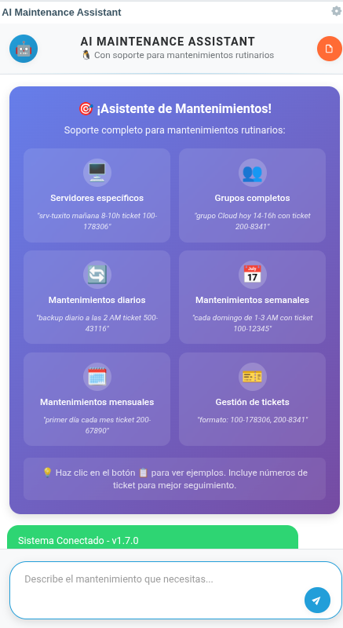
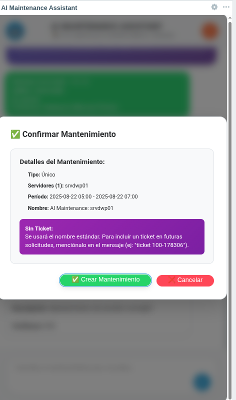

# AI Maintenance for Zabbix 7.2

Servicio Flask para crear y gestionar mantenimientos (únicos y rutinarios) en Zabbix 7.2 con ayuda de IA (Gemini u OpenAI). Soporta detección de tickets en el nombre del mantenimiento.

**Desarrollado por: Grover T.**

Sistema interactivo de mantenimientos para Zabbix 7.2 con inteligencia artificial. Permite crear mantenimientos únicos y rutinarios usando lenguaje natural, con soporte completo para bitmasks avanzados y gestión de tickets.

## 🚀 Ejecución rápida con Docker
```bash
cp backend/.env.example backend/.env
# Edita .env con tus valores (ZABBIX_API_URL, ZABBIX_TOKEN, IA, etc.)
cd backend && docker compose up -d --build
```

## 📁 Componentes

| Componente | Descripción | Documentación |
|------------|-------------|---------------|
| **[Backend](./backend/)** | API Flask con IA (Python) | [Setup Guide](./backend/README.md) |
| **[Widget](./widget/)** | Frontend para Zabbix | [Installation Guide](./widget/README.md) |
| **[Docs](./docs/)** | Documentación completa | [Full Installation](./docs/INSTALLATION.md) |

## Características Principales

### 🤖 Inteligencia Artificial Conversacional
- **Chat interactivo** con IA para crear mantenimientos usando lenguaje natural
- **Soporte para OpenAI** (GPT-4, GPT-3.5) y **Google Gemini**
- **Detección automática** de servidores, grupos, fechas, horarios y tickets
- **Respuestas contextuales** con ejemplos automáticos

### 🔄 Mantenimientos Rutinarios Avanzados
- **Diarios**: Todos los días o cada X días
- **Semanales**: Con bitmasks para múltiples días de la semana
- **Mensuales**: Por día específico (ej: día 5) o día de semana (ej: primer domingo)
- **Cálculo automático** de bitmasks complejos por IA

### 🎫 Gestión de Tickets
- **Detección automática** de números de ticket (formato: XXX-XXXXXX)
- **Nombres personalizados** basados en tickets
- **Integración completa** en descripciones y reportes

### 🎯 Búsqueda Inteligente
- **Búsqueda exacta y flexible** de hosts y grupos
- **Soporte para tags de triggers**
- **Múltiples métodos** de identificación de recursos

## Arquitectura

```
┌─────────────────┐    ┌──────────────────┐    ┌─────────────────┐
│   Zabbix 7.2    │    │   AI Backend     │    │   Zabbix Widget │
│   Frontend       │◄──►│   (Python)       │◄──►│   (JavaScript)  │
│                 │    │                  │    │                 │
│  • Widget UI    │    │  • Flask API     │    │  • Interactive  │
│  • Dashboard    │    │  • OpenAI/Gemini │    │    Chat         │
│  • Config       │    │  • Zabbix API    │    │  • Validation   │
└─────────────────┘    └──────────────────┘    └─────────────────┘
```

## Instalación

### 1. Backend con Docker

#### Instancia Única
```bash
docker run -d \
  --name aima-backend \
  --restart unless-stopped \
  -p 5005:5005 \
  -e ZABBIX_API_URL="https://your-zabbix.com/api_jsonrpc.php" \
  -e ZABBIX_TOKEN="your_api_token" \
  -e AI_PROVIDER="gemini" \
  -e GOOGLE_API_KEY="your_gemini_key" \
  -e GEMINI_MODEL="gemini-2.0-flash" \
  -e TZ="America/Lima" \
  ghcr.io/grovertaipe/ia-sheduler-zabbix:latest
```

#### Múltiples Instancias con Docker Compose

```yaml
version: '3.8'

x-aima: &aima_base
  image: ghcr.io/grovertaipe/ia-sheduler-zabbix:latest
  restart: unless-stopped
  extra_hosts:
    - "host.docker.internal:host-gateway"
  networks:
    - aimaintenance_net

services:
  aima1:
    <<: *aima_base
    container_name: aima1
    env_file: [ ./env/aima1.env ]
    environment:
      TZ: "America/Lima"
    ports: [ "5005:5005" ]
    
  aima2:
    <<: *aima_base
    container_name: aima2
    env_file: [ ./env/aima2.env ]
    environment:
      TZ: "America/Lima"
    ports: [ "5006:5005" ]
    
  aima3:
    <<: *aima_base
    container_name: aima3
    env_file: [ ./env/aima3.env ]
    environment:
      TZ: "America/Lima"
    ports: [ "5007:5005" ]
    
  aima4:
    <<: *aima_base
    container_name: aima4
    env_file: [ ./env/aima4.env ]
    environment:
      TZ: "America/Lima"
    ports: [ "5008:5005" ]
    
  aima5:
    <<: *aima_base
    container_name: aima5
    env_file: [ ./env/aima5.env ]
    environment:
      TZ: "America/Lima"
    ports: [ "5009:5005" ]

networks:
  aimaintenance_net:
    driver: bridge
    ipam:
      config:
        - subnet: 172.31.10.0/24
```

### 2. Configuración de Variables de Entorno

Crear archivos de configuración por instancia:

**env/aima1.env**
```bash
# Configuración de Zabbix
ZABBIX_API_URL=https://zabbix1.example.com/api_jsonrpc.php
ZABBIX_TOKEN=your_zabbix_token_1

# Configuración de IA - Gemini
AI_PROVIDER=gemini
GOOGLE_API_KEY=your_gemini_api_key
GEMINI_MODEL=gemini-2.0-flash

# Configuración de IA - OpenAI (alternativa)
#AI_PROVIDER=openai
#OPENAI_API_KEY=your_openai_key
#OPENAI_MODEL=gpt-4

# Timezone
TZ=America/Lima
```

**env/aima2.env**
```bash
# Diferentes servidores Zabbix por instancia
ZABBIX_API_URL=https://zabbix2.example.com/api_jsonrpc.php
ZABBIX_TOKEN=your_zabbix_token_2
AI_PROVIDER=gemini
GOOGLE_API_KEY=your_gemini_api_key
GEMINI_MODEL=gemini-1.5-flash
TZ=America/Lima
```

### 3. Widget de Zabbix

```bash
# 1. Descargar e instalar
sudo cp -r widget/src/aimaintenance /usr/share/zabbix/ui/modules/aimaintenance
sudo chown -R www-data:www-data /usr/share/zabbix/ui/modules/aimaintenance
```

2. **Escanear módulos** en Zabbix: Administration → General → Modules → Scan directory
3. **Agregar widget** al dashboard: Dashboard → Edit → Add widget → AI Maintenance Assistant
4. **Configurar URL** del backend (ej: `http://localhost:5005`)

## Configuración

### Variables de Entorno Requeridas

| Variable | Descripción | Ejemplo |
|----------|-------------|---------|
| `ZABBIX_API_URL` | URL de la API de Zabbix | `https://zabbix.com/api_jsonrpc.php` |
| `ZABBIX_TOKEN` | Token de API de Zabbix 7.2 | `abc123...` |
| `AI_PROVIDER` | Proveedor de IA (`gemini` o `openai`) | `gemini` |
| `GOOGLE_API_KEY` | API Key de Google Gemini | `AIza...` |
| `GEMINI_MODEL` | Modelo de Gemini | `gemini-2.0-flash` |
| `OPENAI_API_KEY` | API Key de OpenAI (opcional) | `sk-...` |
| `OPENAI_MODEL` | Modelo de OpenAI (opcional) | `gpt-4` |
| `TZ` | Timezone | `America/Lima` |

### Obtener Credenciales

#### Zabbix API Token
1. **Login** a Zabbix → Administration → API tokens
2. **Create API token** con permisos de mantenimiento
3. **Copiar** el token generado

#### Google Gemini API Key
1. Ir a [Google AI Studio](https://aistudio.google.com/)
2. **Get API key** → Create API key
3. **Habilitar** Gemini API en Google Cloud Console

#### OpenAI API Key (Opcional)
1. Ir a [OpenAI Platform](https://platform.openai.com/)
2. **API keys** → Create new secret key
3. **Configurar** billing para usar GPT-4

## Uso

### Ejemplos de Solicitudes

#### Mantenimientos Únicos
```
"Mantenimiento para srv-web01 mañana de 8 a 10 con ticket 100-178306"
"Poner servidor SRV-TUXITO en mantenimiento hoy de 14 a 16 horas"
"Mantenimiento del grupo database el domingo de 2 a 4 AM"
```

#### Mantenimientos Rutinarios

**Diarios:**
```
"Backup diario para srv-backup de 2 a 4 AM con ticket 200-8341"
"Limpieza de logs cada día a las 23:00 ticket 500-43116"
```

**Semanales:**
```
"Mantenimiento semanal domingos de 1-3 AM ticket 100-178306"
"Actualización cada viernes a las 22:00 con ticket 200-8341"
"Mantenimiento jueves y viernes de 5 a 7 AM"
```

**Mensuales:**
```
"Limpieza el día 5 de cada mes con ticket 500-43116"
"Mantenimiento primer domingo de cada mes ticket 100-178306"
"Optimización último viernes de enero, abril, julio y octubre"
```

### Formatos de Fecha Soportados
- `"24/08/25 10:00am"` → `"2025-08-24 10:00"`
- `"hoy de 14 a 16"` → Fecha actual con horario
- `"mañana de 8 a 10"` → Fecha siguiente con horario
- `"domingo de 2 a 4 AM"` → Próximo domingo

### Formato de Tickets
- **Patrón:** `XXX-XXXXXX` (3 dígitos - 3-6 dígitos)
- **Ejemplos válidos:** `100-178306`, `200-8341`, `500-43116`
- **Detección automática** en el texto de la solicitud

## API Endpoints

### Principales
- `POST /chat` - Chat interactivo principal
- `POST /create_maintenance` - Crear mantenimiento
- `GET /health` - Estado del sistema

### Utilidades
- `POST /search_hosts` - Buscar hosts
- `POST /search_groups` - Buscar grupos
- `GET /maintenance/list` - Listar mantenimientos
- `GET /maintenance/templates` - Plantillas rutinarias
- `POST /test/routine` - Probar configuraciones

### Ejemplo de Respuesta
```json
{
  "type": "maintenance_request",
  "hosts": ["srv-web01"],
  "start_time": "2025-08-24 10:00",
  "end_time": "2025-08-24 16:00",
  "recurrence_type": "weekly",
  "recurrence_config": {
    "start_time": 18000,
    "duration": 7200,
    "dayofweek": 24,
    "every": 1
  },
  "ticket_number": "100-178306",
  "confidence": 95
}
```

## Arquitectura Técnica

### Bitmasks para Mantenimientos Rutinarios

#### Días de Semana
```
Lunes: 1, Martes: 2, Miércoles: 4, Jueves: 8
Viernes: 16, Sábado: 32, Domingo: 64

Ejemplos:
- Solo lunes: 1
- Jueves y viernes: 8 + 16 = 24  
- Fines de semana: 32 + 64 = 96
- Toda la semana: 127
```

#### Meses del Año
```
Enero: 1, Febrero: 2, Marzo: 4, ... Diciembre: 2048

Ejemplos:
- Solo enero: 1
- Trimestre 1: 1 + 2 + 4 = 7
- Todo el año: 4095
```

#### Ocurrencias de Semana (Mensual)
```
Primera: 1, Segunda: 2, Tercera: 3, Cuarta: 4, Última: 5

Ejemplos:
- Primer lunes: dayofweek=1, every=1
- Último viernes: dayofweek=16, every=5
```

### Flujo de Procesamiento

1. **Usuario** envía solicitud en lenguaje natural
2. **IA** analiza y estructura la información
3. **Backend** busca recursos en Zabbix
4. **Validación** de configuración y bitmasks
5. **Confirmación** al usuario con detalles
6. **Creación** del mantenimiento en Zabbix
7. **Respuesta** con ID y configuración final

## Monitoreo y Logs

### Health Check
```bash
curl http://localhost:5005/health
```

Respuesta esperada:
```json
{
  "status": "healthy",
  "zabbix_connected": true,
  "ai_provider": "gemini",
  "version": "1.7.0",
  "features": ["interactive_chat", "routine_maintenance", "ticket_support"]
}
```

### Logs de Docker
```bash
# Ver logs de una instancia
docker logs aima1

# Seguir logs en tiempo real
docker logs -f aima1

# Logs de todas las instancias
docker-compose logs -f
```

## Troubleshooting

### Problemas Comunes

#### Backend no inicia
```bash
# Verificar variables de entorno
docker exec aima1 env | grep -E "(ZABBIX|AI_|GOOGLE|OPENAI)"

# Verificar conectividad a Zabbix
curl -X POST https://your-zabbix.com/api_jsonrpc.php \
  -H "Content-Type: application/json" \
  -H "Authorization: Bearer your_token" \
  -d '{"jsonrpc":"2.0","method":"user.get","params":{"limit":1},"id":1}'
```

#### Widget no conecta
1. **Verificar URL** del backend en configuración del widget
2. **Revisar puertos** expuestos (5005-5009)
3. **Comprobar red** entre Zabbix y containers
4. **Revisar CORS** en logs del backend

#### IA no responde
1. **Verificar API Keys** de Gemini/OpenAI
2. **Revisar límites** de rate limiting
3. **Comprobar balance** de cuenta de IA
4. **Probar endpoint** `/health` para diagnóstico

### Validación de Configuración
```bash
# Probar configuración rutinaria
curl -X POST http://localhost:5005/test/routine \
  -H "Content-Type: application/json" \
  -d '{
    "recurrence_type": "weekly",
    "recurrence_config": {
      "dayofweek": 24,
      "start_time": 18000,
      "duration": 7200
    }
  }'
```

## Ejemplo de funcionamiento del widget

Vista del widget en el dashboard de Zabbix:



Vista del formulario de configuración:



## Contribuir

### Desarrollo Local
```bash
# Clonar repositorio
git clone https://github.com/grovertaipe/ia-scheduler-zabbix.git

# Backend
cd backend
pip install -r requirements.txt
python src/main.py

# Widget
cp -r widget/src/aimaintenance /usr/share/zabbix/ui/modules/aimaintenance
```

### Reportar Issues
1. **Incluir logs** del backend y frontend
2. **Especificar versiones** de Zabbix, Docker, etc.
3. **Describir pasos** para reproducir el problema
4. **Adjuntar configuración** (sin credenciales)

## Licencia

Proyecto desarrollado por **Grover T.** bajo licencia MIT.

## Soporte

- **Repository:** [GitHub](https://github.com/grovertaipe/ia-scheduler-zabbix)
- **Docker Image:** [ghcr.io/grovertaipe/ia-sheduler-zabbix](https://ghcr.io/grovertaipe/ia-sheduler-zabbix)
- **Zabbix Version:** 7.2+
- **Python Version:** 3.9+

---

**Versión:** 1.7.0  
**Última actualización:** 2025  
**Autor:** Grover T.